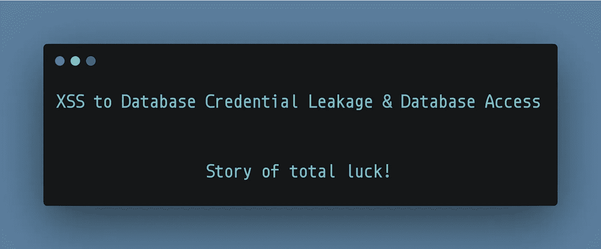

# 从 XSS 到数据库凭据泄露和数据库访问——全凭运气的故事！

> 原文：<https://infosecwriteups.com/xss-to-database-credential-leakage-database-access-story-of-total-luck-77c990be8ab2?source=collection_archive---------1----------------------->

当您向某些输入解析功能提供恶意 javascript 代码时，会发生反射式跨站点脚本，由于缺乏净化和过滤，应用程序会将您的恶意代码视为有效输入进行处理，因此通常会给出一个**快乐弹出窗口。**

然而，当它是你的幸运日，只是为了娱乐和学习，你试图增加影响，突然服务器崩溃，揭示了**数据库凭证，你的大脑只说一件事“这是一个神圣的冒险时间”。**

嗨，各位黑客和爱好者，今天，我将分享我最近在玩反射 XSS 时偶然发生的奇怪而幸运的经历。让我们把这个目标叫做**“rededited . com”。**

应用程序"**redated . com "**在域名*blog.redacted.com 的 **Wordpress** 上有一个博客网站。*当谈到 Wordpress 时，你可以执行的攻击媒介相对较少，因为它是有限的，并且作为第三方服务，你不能测试每一个功能。足够幸运的是，我用这个简单的有效载荷**在几分钟内就在搜索栏**中找到了一个**反映的 XSS。**

就这样？我只是报告它，虽然探索其他领域的应用，但没有运气。我越来越无聊，所以我计划检查一些新的“XSS 有效载荷”发现从网上资源和 Portswigger 学院，看看他们是如何工作的。我刚刚用所有可能的最大线程数**运行了入侵者，即 999，然后**走开了。

当我回来并导航到**“blog . redated . com”**来检查 XML-RPC 和其他东西时，我发现**应用程序崩溃了，错误消息显示了“包含登录凭证的数据库连接字符串”。**

在四处摆弄之后，试图通过“wp-admin”端点登录，没有成功，但我还是报告了。突然间，我再次开始执行递归目录搜索，幸运的是，我发现 **"/server/phpmyadmin"** 目录可以公开访问。我访问了端点并找到了 **PhpMyAdmin** 登录页面，我使用了从**错误消息和成功登录&中显示的凭证来访问所有数据库。**

迅速添加了评论并更新了我最初的概念验证报告。同一天审判为 P1，三天固定。:)

发生这种情况的可能原因是，在从数据库中搜索和检索数据时，恶意 javascript 负载可能破坏了 MySQL 查询字符串逻辑，导致临时错误消息，直到缓存过期。

**外卖**

*   如果某些功能与数据库交互，并且您发现了该功能的任何缺陷，只要允许，就进行一点点**压力测试。**有时由于处理不当，后端逻辑可能会暂时中断，错误消息可能会透露您感兴趣的信息。
*   你永远不知道什么时候是你的幸运日，永远不要停止寻找东西。你一定会成功的。

**如果你喜欢这篇文章，请鼓掌并在推特上关注:D 的新帖子、技巧和推文**

推特:https://twitter.com/harshbothra_