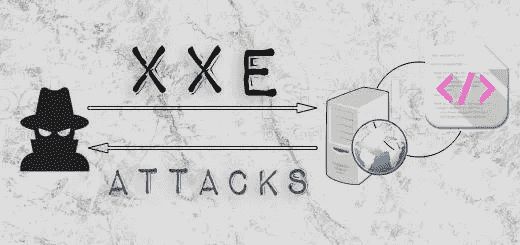
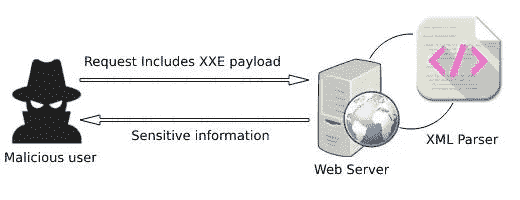
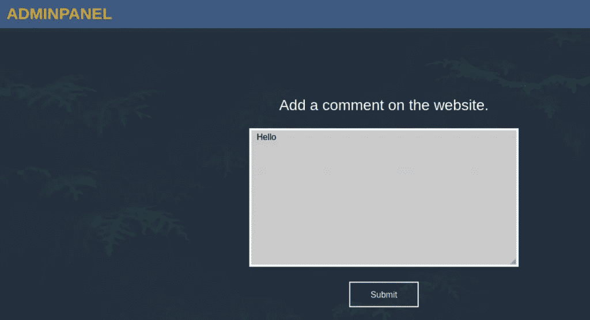
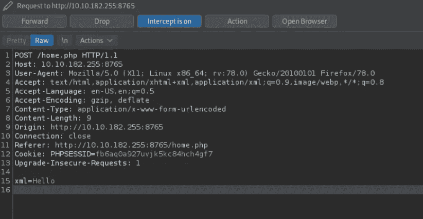
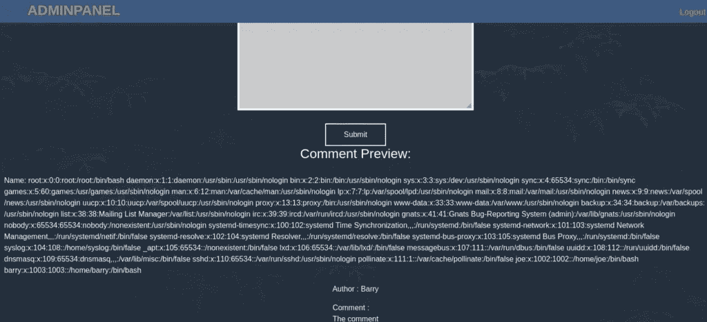

# XXE 袭击解释说

> 原文：<https://infosecwriteups.com/xxe-attacks-explained-5fc1d9cc7960?source=collection_archive---------1----------------------->

在当今威胁 web 应用的众多攻击中， **XXE** 仍然是被谈论得最少的一种。尽管它比[【XSS】](https://patchthenet.com/articles/introduction-to-cross-site-scripting-xss/)或 [SQL 注入](https://patchthenet.com/articles/introduction-to-sql-injection/)受到的关注要少得多，但它确实有自己的风险，不应该被轻视。

在本指南中，我将尝试解释什么是 XXE，为什么它是危险的，以及如何防范它。但是，在我们了解这种攻击之前，我们首先需要了解一些关于 XML 的事情。



# XML 简介

**XML** ( **可扩展标记语言**)是一种基于标记的语言，应用程序使用它来传输数据。与其他基于标记的语言(如 HTML)相反，XML 没有预定义的标记。相反，这些是由用户定义的。

下面是一个 XML 代码的示例:

```
<email>
 <sender>John</sender>
 <recipient>Peter</recipient>
 <subject>Hi</subject>
 <message>Hi Peter, How are you doing?</message>
</email>
```

在上面的代码中， *email* 标签包含 4 个子标签:*发件人*、*收件人*、*主题*和*消息*。这些标签中的每一个都包含一个字符串，在 XML 中称为解析字符数据(或 **PCDATA** )。

## XML 文件声明

XML 文件应该以一个 **XML 声明**开始。这至少应该包括文件使用的 XML 的*版本*。它也可以包括*编码*和*独立*作为选项。这两个是可选的，但是*版本*属性是强制的。

XML 文件声明应该是这样的:

```
<?xml version="1.1" encoding="UTF-8" standalone"yes"?>
```

如您所见，有三种不同的属性:

*   **版本:**可以是 1.0，也可以是 1.1。如果不编写 XML 声明，则版本默认为 XML 1.0。
*   **编码:**在大多数情况下，你会使用 UTF-8。但是，根据所使用的字符，您可以为该属性指定 UTF-16。
*   **独立:**该属性可以有值，也可以没有值。它指示 XML 文件是否依赖于任何其他文件才能正常工作。

## 文档类型定义(DTD)

**DTD** ( **文档类型定义**)定义了 XML 文档的结构，这样不同的人就可以同意使用相同的元素和属性。

有两种不同类型的 dtd:

**1-内部 DTD**

当 XML 文档包含其自身结构的定义时，该定义就是我们所说的内部 DTD。它包含在文件开头的标签`<!DOCTYPE>`中，就在 XML 声明之后。

下面是一个内部 DTD 的示例:

```
<!DOCTYPE email [ 
 <!ELEMENT email (sender,recipient,subject,message)>
 <!ELEMENT sender (#PCDATA)>
 <!ELEMENT recipient (#PCDATA)>
 <!ELEMENT subject (#PCDATA)>
 <!ELEMENT message (#PCDATA)>
]>
```

对于`!DOCTYPE email`，我们将 *email* 定义为 XML 文档的根元素。

第二行指定 *email* 元素应该包含四个子元素:*发件人*、*收件人*、*主题*和*消息*。

之后，我们指定这些子元素中的每一个都应该包含已解析的字符数据(PCDATA)。

您可能已经注意到，这个 DTD 定义了与我们在前面的 XML 代码示例中看到的相同的结构。

**2-外部 DTD**

对于第二种类型，我们在外部文件中定义 XML 结构。在这种情况下，`<!DOCTYPE>`标签应该包含使用系统关键字的 DTD 文件的 URL。

我们需要将下面一行添加到 XML 文档的开头，就在 XML 声明行之后。

```
<!DOCTYPE email SYSTEM "email.dtd">
```

下面是外部 DTD 文件“email.dtd”包含的内容:

```
<!ELEMENT email (sender,recipient,subject,message)>
<!ELEMENT sender (#PCDATA)>
<!ELEMENT recipient (#PCDATA)>
<!ELEMENT subject (#PCDATA)>
<!ELEMENT message (#PCDATA)>
```

这里，DTD 定义了与我们之前看到的例子中相同的结构。

## XML 实体

一个 **XML 实体**是一个字符串，当在文档中遇到时，XML 解析器用另一个值替换它。这类似于编程语言中的变量。

实体的书写形式为:与号(&) +实体名称+分号(；).

除了用户定义的实体，还有许多内置实体。这样的例子有`&lt;`和`&gt;`，它们分别被小于(<)和大于(>)字符替换。

类似于 dtd，有两种类型的实体:内部和外部。

**1-内部实体**

**内部**实体定义如下:

```
<!ENTITY name "value">
```

每当文件中有一个`&name;`时，XML 解析器就用*值*替换它。

**2-外部实体**

另一方面，**外部**实体使用系统关键字引用 URL，而不是提供值。

```
<!ENTITY name SYSTEM "URL">
```

类似于内部实体，每当解析器在 XML 文件中遇到一个`&name;`，它就用外部实体声明引用的 URL 的内容替换它。

# XXE 简介

**XXE** ( **XML 外部实体**)是一种利用 XML 文件中外部实体的攻击类型。

一些网站依靠 XML 在浏览器和网络服务器之间传输数据。当它接收到 XML 格式的数据时，web 服务器将它传输到一个 XML 解析器来处理这些数据。



正如我们在上一节中看到的，XXE 或 XML 外部实体本身并不是一个漏洞。像任何其他 XML 特性一样，它们只是语言固有的一部分。因此，默认情况下，XML 解析器会解释它们。并且，正如预期的那样，它将加载他们调用的外部内容。当然，这可以通过一些安全的配置实践来避免，我们将在本文的后面讨论这些实践。

现在，恶意用户可以利用这一 XML 特性来定义从服务器端检索敏感文件的外部实体，从而利用易受攻击的 XML 解析器。

让我们通过一个简单的例子来看看这是如何工作的。

## XXE 攻击示例

为了演示 XXE 攻击的影响，我们将使用一个取自 [TryHackMe](https://tryhackme.com/) 的穆斯塔基奥房间的例子。

如下图所示，我们有一个可以在网站上添加评论的表单输入。



在 Burp Suite 上启用了代理拦截之后，我输入了 Hello 并提交了表单。

在 Burp Suite 上，我截获了以下请求。



我们可以看到 web 应用程序将“Hello”值存储在一个名为 *xml* 的变量中。这暗示了它可以接受 XML 代码作为输入的可能性。

在做了一些枚举之后，我已经设法获得了添加注释的正确 XML 结构，如下所示:

```
<comment>
 <name>Name</name>
 <author>Author</name>
 <com>Comment</com>
</comment>
```

因此，记住这一点，让我们用下面的代码来更改 *xml* 参数值:

```
<?xml version="1.0"?>
<!DOCTYPE payload [
<!ENTITY malicious SYSTEM "file:///etc/passwd">
]>
<comment>
<name>&malicious</name>
<author>Barry</author>
<com>The comment</com>
</comment>
```

有效载荷应该不难理解。我们已经将*恶意的*定义为一个外部实体，我们将文件`file:///etc/passwd`的内容作为它的值与之相关联。

当 XML 解析器到达`&malicious;`时，它将在它的位置加载`/etc/passwd`的内容，从而泄露来自 web 服务器的敏感信息，如下图所示。



## 如何防范 XXE 袭击

幸运的是，XXE 的攻击并不总是有效的。他们的成功需要目标网站上的错误配置。因此，通过确保我们的网站没有这些糟糕的配置设置，我们可以降低 XXE 攻击的风险。

这里有一些我们可以实现的好的实践。

*   在 XML 解析器上禁用 dtd 和外部实体。
*   在处理用户提供的输入之前，一定要对其进行验证和消毒。
*   不断修补和更新 XML 解析器。
*   使用 SAST 和 DAST 工具扫描 web 应用程序。

# 结论

所以，我们已经到了这篇文章的结尾。我们已经开始学习 XML、实体和 dtd。然后我们了解了 XXE 袭击，以及他们是如何进行的。然后，我们看到了一个使用 TryHackMe room 的 XXE 攻击示例。我们还列出了一些防止这些攻击发生的良好实践。

综上所述，我们仅仅触及了 XXE 袭击及其影响的皮毛。这种攻击还有许多其他变种，从拒绝服务到敏感信息泄露。还有很多东西要学。我邀请你继续阅读这篇文章。为了帮助你，OWASP 可能是一个很好的下一步，在那里你可以学到更多关于这个主题的知识。

*原载于 2021 年 12 月 12 日*[*【https://patchthenet.com】*](https://patchthenet.com/articles/xxe-attacks-explained/)*。*