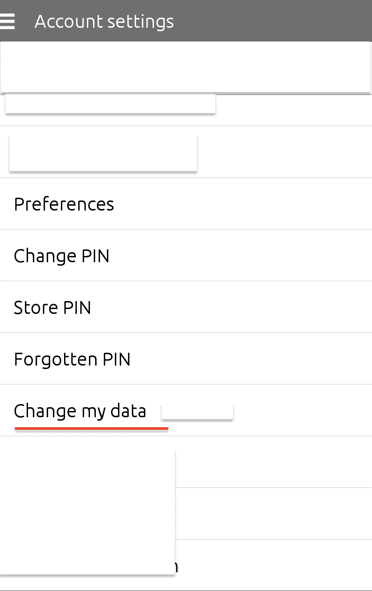
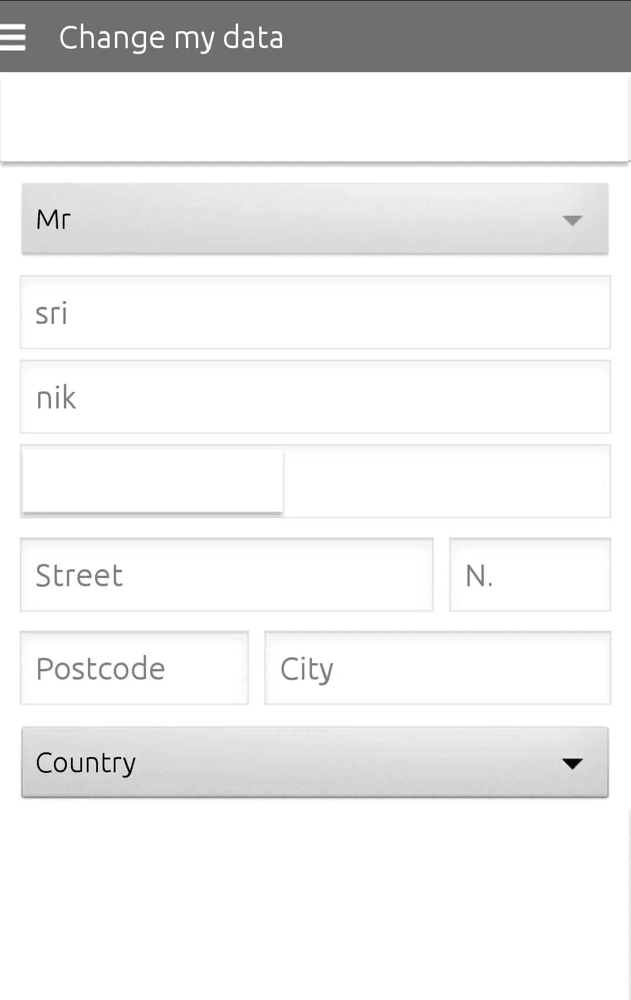
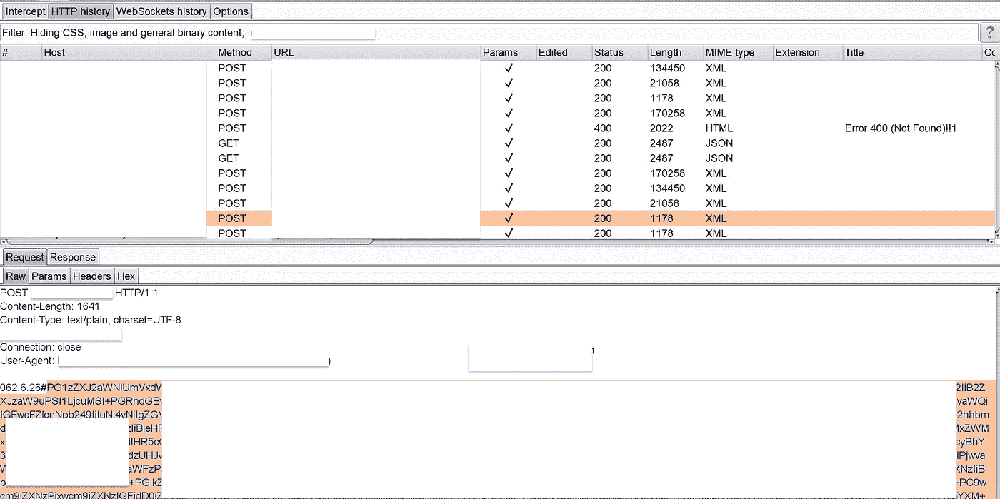
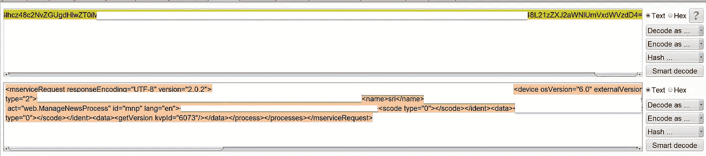
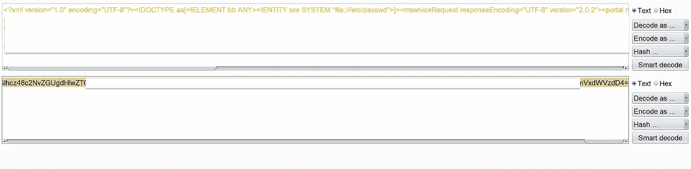
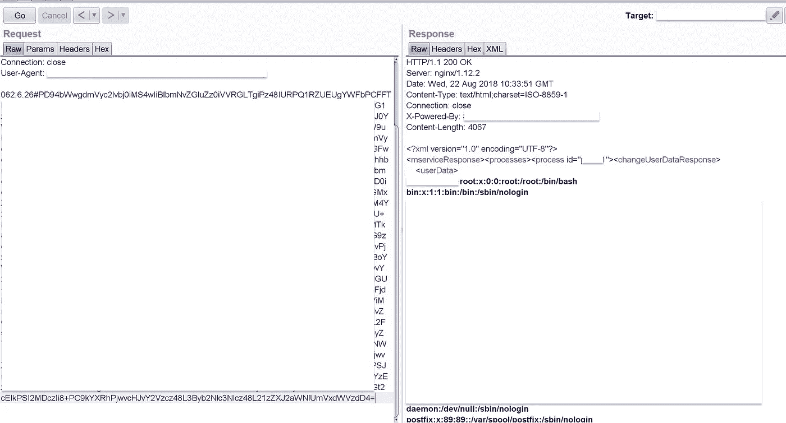
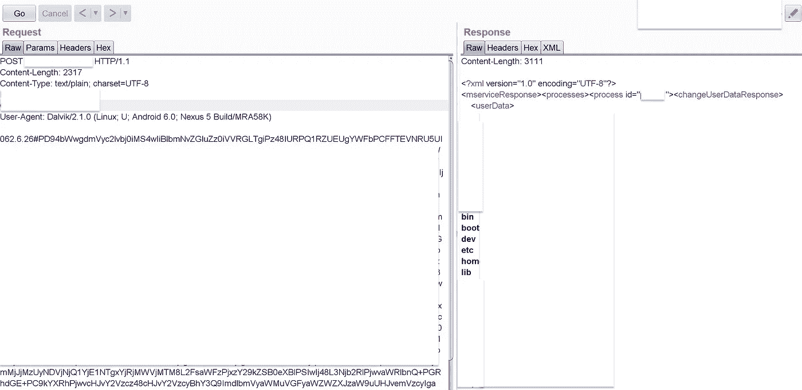
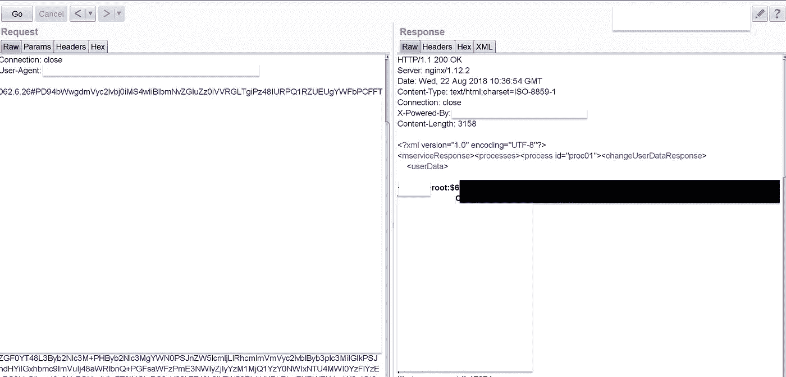
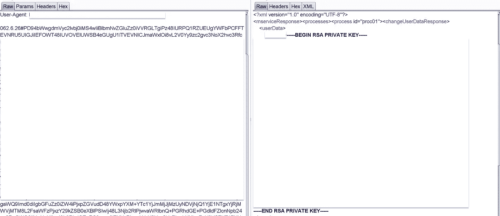

# 公交售票手机 APP 中的 XXE

> 原文：<https://infosecwriteups.com/xxe-in-public-transport-ticketing-mobile-app-81ae245c01a1?source=collection_archive---------2----------------------->

这个发现是另一个私人的臭虫奖励计划。目标的范围是一个票务 android 应用程序(Prod)。这个应用程序是一个主要的德国公共交通票务应用程序。

在登录 android 应用程序并浏览帐户设置后，我遇到了一个“更改我的数据”选项。



在下一个屏幕中，我必须修改我的个人数据



保存数据时，我发现以下请求被发送到服务器



请求格式类似于`062.6.26#{some long data}.`这看起来很有趣。接下来，我选择了{一些长数据}并发送给解码器。我试着解码，发现是 base64。解码的数据是一个 XML，如下图所示



很好，接下来我加入了下面的 XXE 载荷

```
<?xml version="1.0" encoding="UTF-8"?><!DOCTYPE aa[<!ELEMENT bb ANY><!ENTITY xxe SYSTEM "file:///etc/passwd">]>
```

并从主体中调用定义的实体`&xxe;`如下图所示:


现在，我需要做的就是将整个有效载荷编码回 base64 格式。



最后，我替换了原始请求中的有效负载，并将请求转发给服务器。然后，砰！我得到了`/etc/passwd`的内容



由于应用程序使用的是 java，您甚至可以通过使用以下有效负载来列出目录

```
<?xml version="1.0" encoding="UTF-8"?><!DOCTYPE aa[<!ELEMENT bb ANY><!ENTITY xxe SYSTEM "file://">]>
```



我主要是在寻找 SSH 私人密钥，但出于好奇，我试图获取`/etc/shadow`(感觉幸运的:D)。而且，出乎我意料的是，我得到了(这种情况很少见)。该响应表明它正在以 root 用户身份运行。



我还发现，SSH 私有密钥在`/home/user/.ssh/`目录中太容易找到了。这意味着我们也可以在系统上执行完整的 RCE，但该计划不允许完整的升级。因此，我没有尝试，并停止了我的测试，直到这里，并报告相同的。



暂时就这样了。下一篇文章再见。保持好奇✌🏻

感谢[巴武克·贾恩](https://medium.com/u/504351aeb258?source=post_page-----81ae245c01a1--------------------------------)、[坎纳特·卡迈勒](https://medium.com/u/af3671776a72?source=post_page-----81ae245c01a1--------------------------------)和金恩的校对。