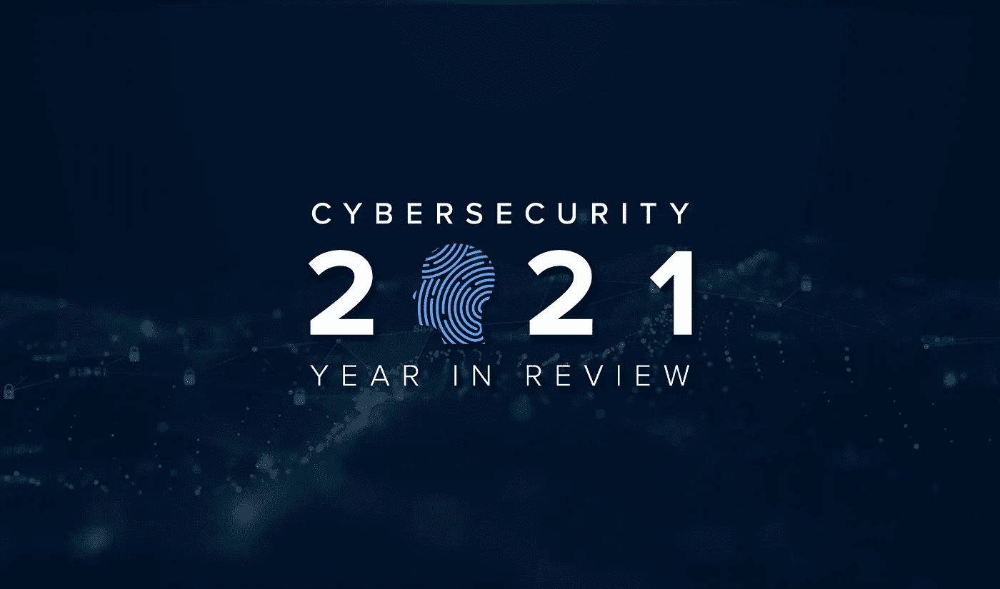
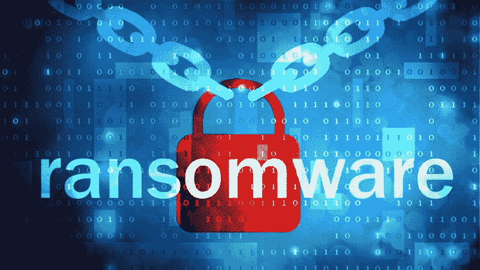
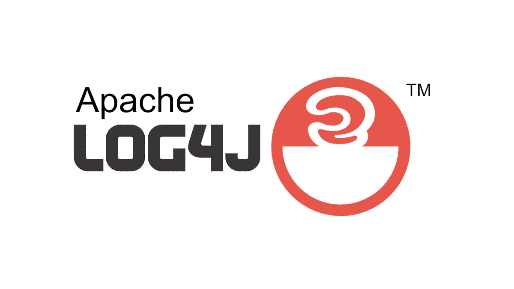

# 2021 年回顾:网络安全领域发生的 5 件大事

> 原文：<https://infosecwriteups.com/year-in-review-2021-top-5-things-that-happened-in-cyber-security-4c6d364993be?source=collection_archive---------1----------------------->

你好黑客，我是尤瓦拉杰。希望你们都过得好；2021 年很可能是数据泄露的一年，因为许多大型科技公司，如脸书、Linkedin、Big basket、twitch 和其他公司也受到了影响。让我们快速回顾一下这一年发生的所有事情。

我们开始吧

# 头号 Mobikwik 数据泄露事件:

今年早些时候，Mobikwik 遭遇了大规模数据泄露，暴露了 6 TB 的用户数据，其中包括电子邮件地址、电话号码、PAN 卡、Adhaar 卡和其他个人信息。然而，另一方面，这是历史上最大的数据泄露。但 Mobikwik 否认了这一泄漏，并表示“任何用户都完全有可能在多个平台上上传了她/他的信息。因此，暗示暗网上的可用数据是从 MobiKwik 或任何已知来源获得的是不正确的。”

# #2 殖民管道攻击:

Colonial pipeline 是美国最大的载油管道系统，被名为 Darkside 的黑客组织黑掉了。这次攻击导致整个管道系统在其 57 年历史上首次关闭。然而，殖民公司支付了价值 440 万美元的 75 比特币赎金来恢复其数据。但是，在联邦调查局和火眼的帮助下，殖民者能够拿回赎金。

# #3 多米诺数据泄露:

像脸书、Linkedin 和 Mobikwik 一样，Dominos 也经历了数据泄露。主要是印度人是这次数据泄露的主要目标。泄露的数据包括电子邮件地址、电话号码、信用卡详细信息、消费金额、订单总数、订单位置和其他敏感信息。黑客在黑暗网络中创建了一个搜索引擎来查询这些信息，并出售这些数据来换取加密货币。

# #4 飞马座:

飞马是一个由 NSO 集团创建的 android 恶意软件。这种恶意软件的目的是让政府机构监视恐怖分子。但是被泄露的数据库中有 5 万个电话号码是针对记者、政治领袖和部长的。pegasus 可以远程安装在智能手机上，无需其所有者采取任何行动，并允许恶意软件运营商完全控制设备，包括从 WhatsApp 和 Signal 等加密消息应用程序中访问消息，启用麦克风和摄像头，甚至跟踪实时位置。

# #5 Log4j 漏洞:

Log4j 是一个基于 java 的日志框架。该框架中的漏洞允许攻击者远程执行代码。然而，这个漏洞影响了互联网的大部分。来自世界各地的安全研究人员开始寻找这个漏洞。许多公司愿意只为这个 bug 支付高达 25000 美元。即使是一个没有多少技术知识的人也可以利用这个漏洞。如果你想了解更多关于 log4j 漏洞的信息，请点击这里查看这篇好文章。

# 最终想法:

如果你认为我错过了什么，请在评论中补充。

新年快乐！！！