# 兔年

> 原文：<https://infosecwriteups.com/year-of-the-rabbit-tryhackme-writeup-by-karthikeyan-a3223529e888?source=collection_archive---------5----------------------->

## TryHackMe

## 是时候进入沃伦了…


# 任务 1:

1.  什么是用户标志？

我们来列举一下机器吧！！！

机器源代码揭秘一页/sup3r_s3cret_fl4g

但是页面被重定向到 Youtube。因此，让我们检查和查看任何可疑的链接

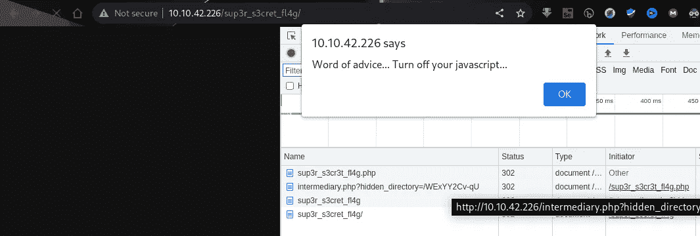

我们在这里找到了一个目录/WExYY2Cv-qU

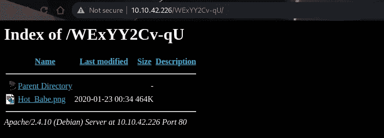

让我们下载并使用字符串命令来搜索任何字符串

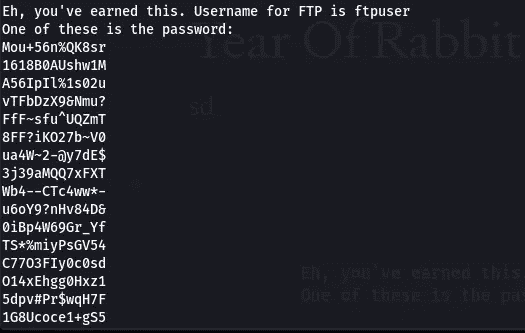

有一个用户名— **ftpuser** ，密码列表包含实际的 ftp 密码

将密码复制到名为 pass.txt 的文本文件中

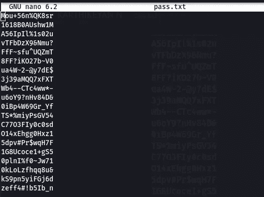

```
Use Hydra to Brute force the Password!!
We got the Password!
Now we are In!!
```

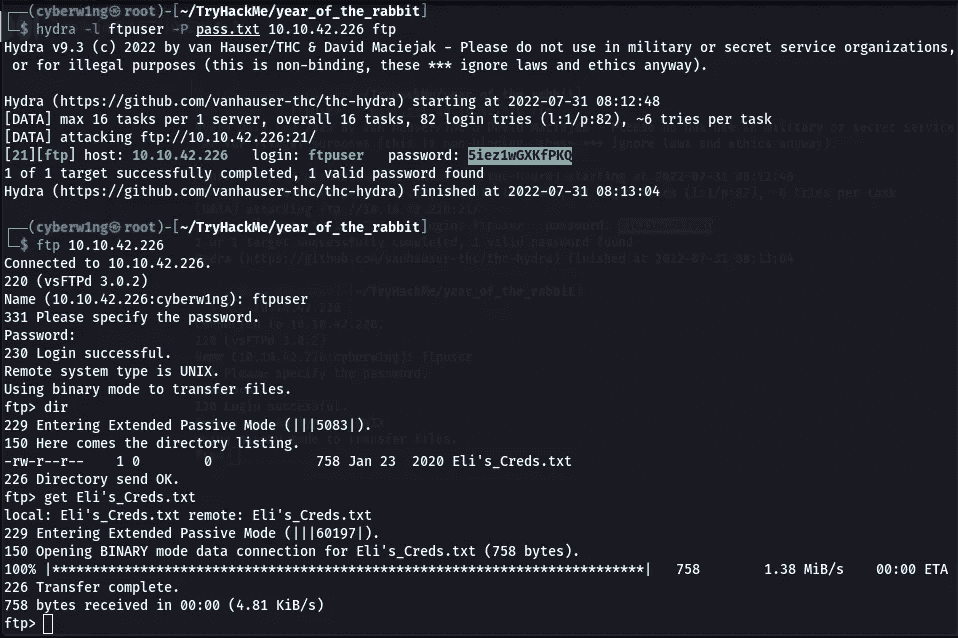

我们从 Ftp 下载的文本文件包含了被称为 BrainFuck 的符号

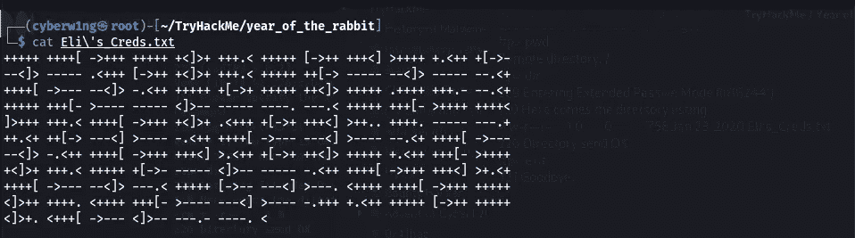

用[网站](https://www.splitbrain.org/_static/ook/)解码！！

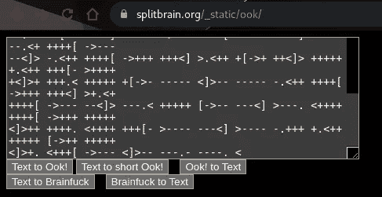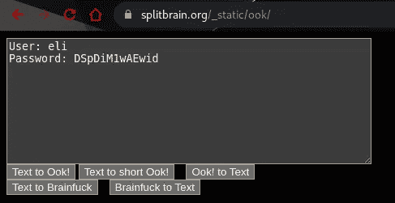

我们拿到证书了

因此，让我们尝试使用上述凭证登录 SSH

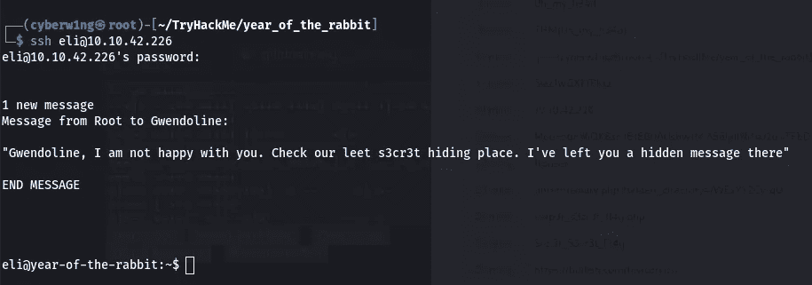

让我们找到“S3cr3t”

```
find / -name “*s3cr3t*” 2>/dev/null
```

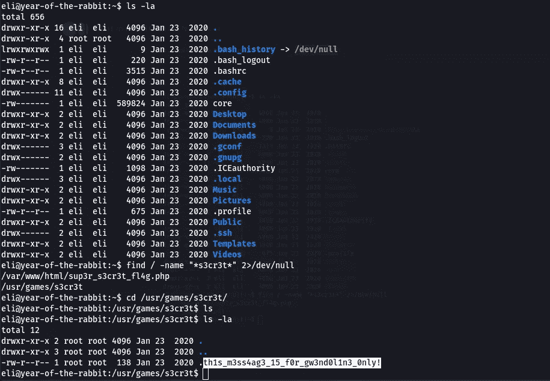

现在我们得到了 Gwendoline 的密码，让我们登录

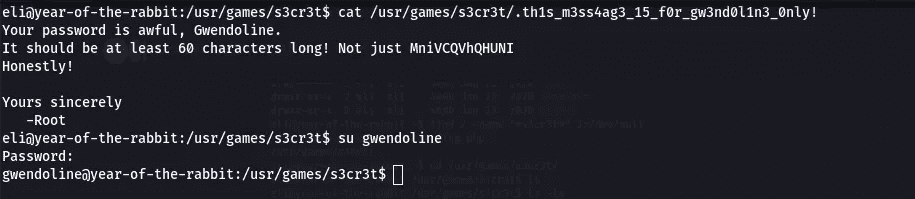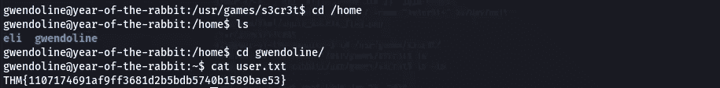

```
Ans: THM{1107174691af9ff3681d2b5bdb5740b1589bae53}
```

2.根旗是什么？

使用下面的命令并添加**:！文件中的/sh**

```
sudo -u#-1 /usr/bin/vi /home/gwendoline/user.txt
```

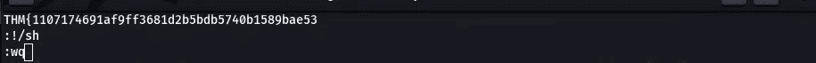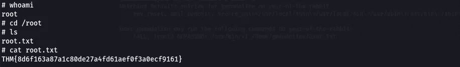

我们现在是根了！！！

```
Ans: THM{8d6f163a87a1c80de27a4fd61aef0f3a0ecf9161}
```

感谢您的阅读！！！

黑客快乐！！

```
Author - Karthikeyan N | Cyberw1ng
```

## 来自 Infosec 的报道:Infosec 每天都有很多内容，很难跟上。[加入我们的每周简讯](https://weekly.infosecwriteups.com/)以 5 篇文章、4 个线程、3 个视频、2 个 GitHub Repos 和工具以及 1 个工作提醒的形式免费获取所有最新的 Infosec 趋势！