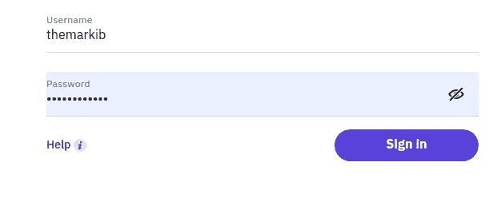
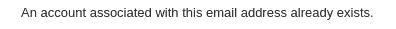
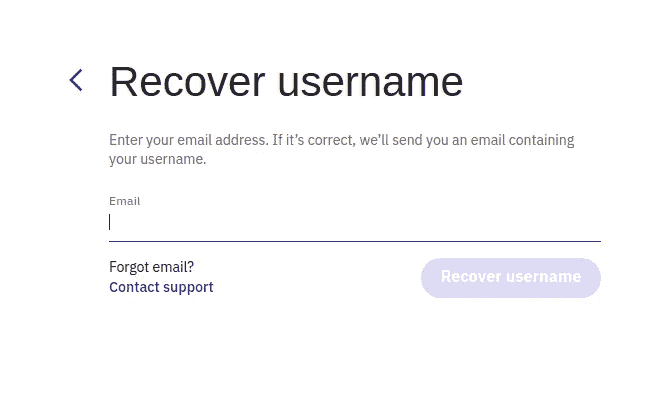
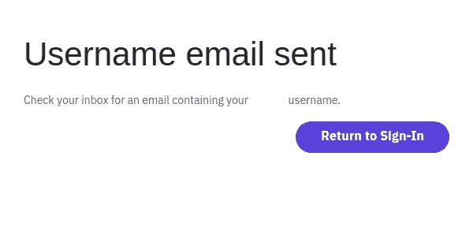
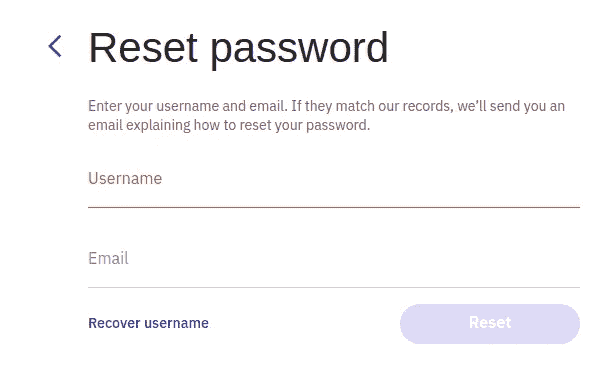
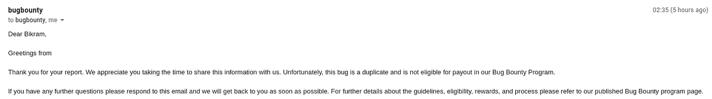

# 你将永远无法在 redacted.com 注册或登录

> 原文：<https://infosecwriteups.com/you-will-never-be-able-to-register-or-login-at-redacted-com-a775831c3bc4?source=collection_archive---------1----------------------->

你好，我是来自尼泊尔的比克拉姆·卡拉尔。我是信息安全专业的学生和工程专业的学生。

今天我将会写一些我最近在漏洞发现程序上发现的错误，所以在这篇博客中我将把它命名为*redacted.com*。当我的在线课程进行时，我正在滚动 twitter，有人建议在那个*编辑过的*网站上搜索。所以我去学习

现在我开始在那个网站上测试。

像往常一样，我在那个网站上注册，并开始了解网站是如何工作的。注册后，它要求我使用 6 位数的代码来验证电子邮件。所以我试着强迫终点，但是有速度限制。

经过一个小时的测试，我意识到这是基于 IP 的速率限制，然后我绕过了使用 IP 旋转扩展在 burpsuite。然后赶紧举报那个 bug.lol

一天后，我从他们那里得到回复，这是**的复制品**。:(

我还在寻找同一个程序的其他 bug。我再次用我的电子邮件在网站上注册，这次我没有验证我的电子邮件。因此，我无法在没有验证电子邮件的情况下登录，在登录流程中，我们需要用户名来登录。

现在我开始想，如果我忘记了我的用户名会发生什么？我将无法登录对吗？我再次尝试用我收到的邮件说重复注册的同一个电子邮件注册。

现在，我转到“帮助”部分，看到了恢复用户名的选项。点击恢复我的用户名选项后，系统会要求发送电子邮件来恢复我的用户名。

我输入我的电子邮件，然后点击恢复用户名。然后它说用户名电子邮件发送。

所以我很快检查了我的电子邮件，但我没有收到任何邮件。我被刷新了 7-8 次以上 lol。我再次试图恢复我的用户名，仍然没有收到任何邮件。我就像

也有重置密码的选项，但我们需要用户名和电子邮件来设置密码。在这种情况下，我们不知道用户名:)

将近 10 个小时后，我点击了注册过程中发送到我邮箱的验证邮件，该邮件也已过期。现在没有任何功能来发送进一步的验证码，这意味着我将永远无法使用该电子邮件在 redacted.com*登录或注册。*

然后我很快地做了一个像这篇中间文章一样混乱的报告，但是一天后我得到回复说这是重复的。这就是我的生活方式

这是我的第一篇媒体文章，可能会有错误，所以你们可以给我一些改进的建议。希望你，喜欢读这篇文章。对于任何问题，你可以在下面评论。

上找我: [**推特**](https://twitter.com/7H3_M4RK18) **。**