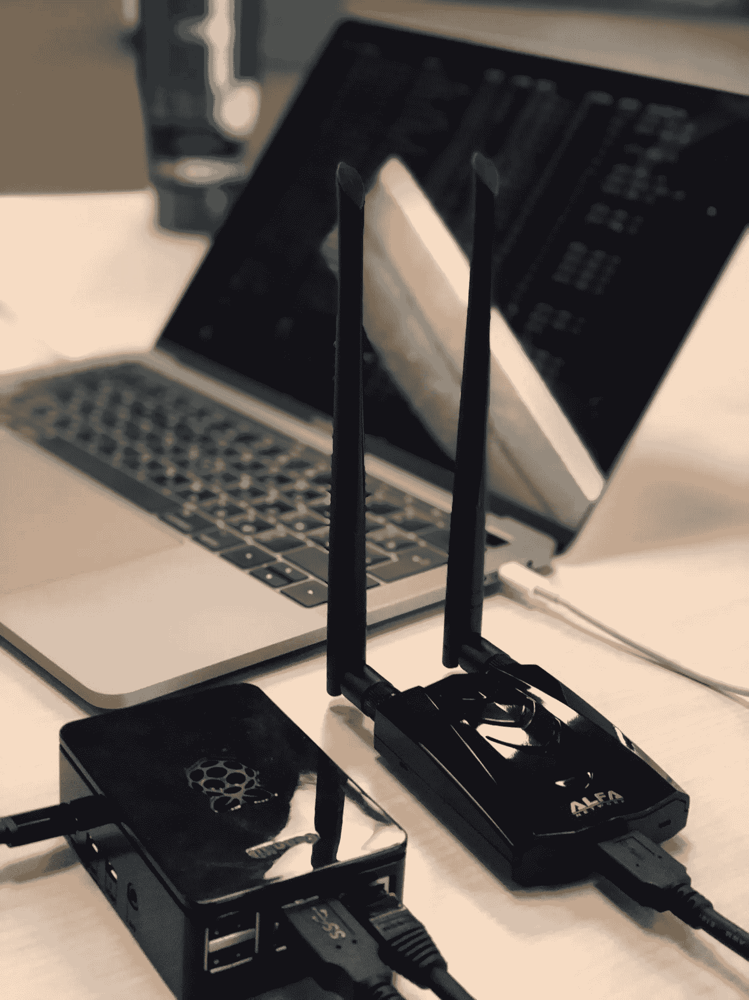
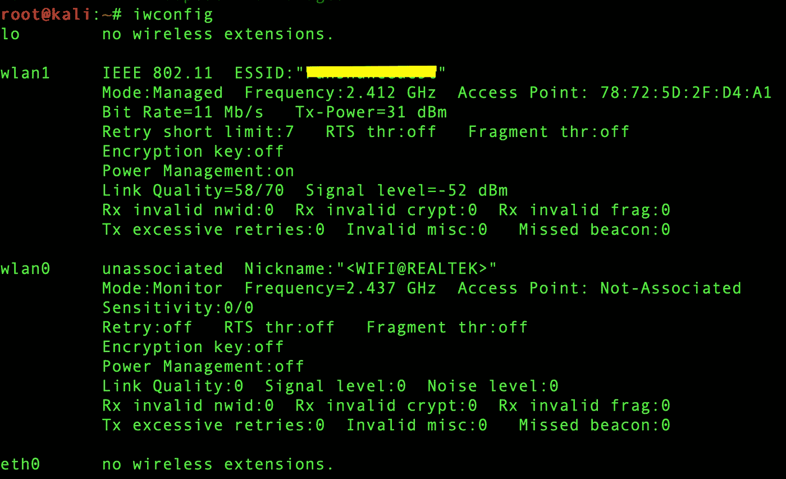
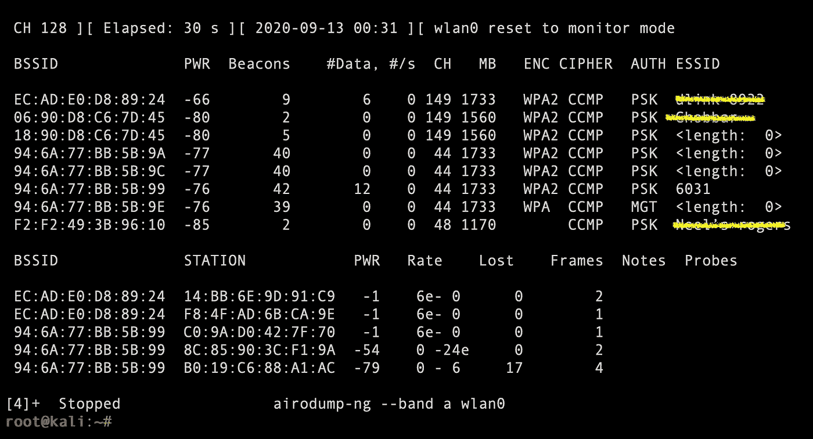
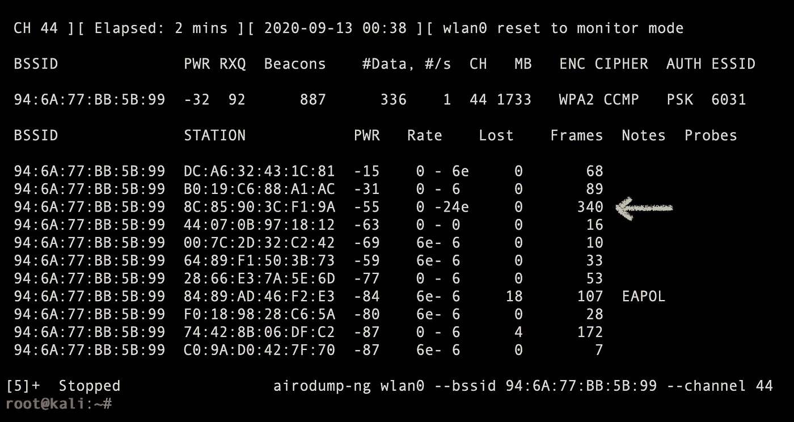
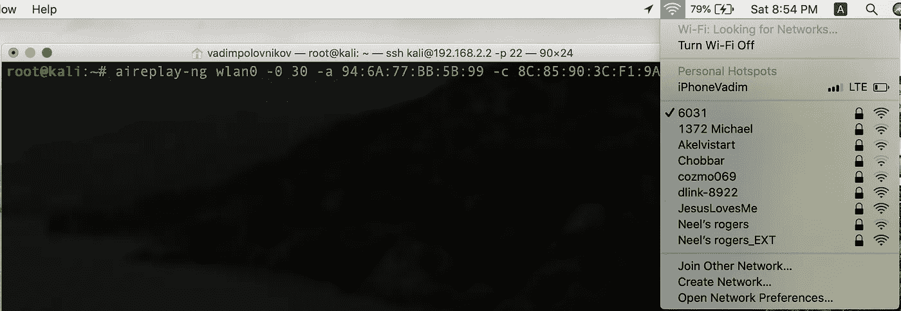
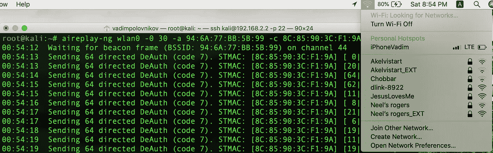

# 你邻居的音乐很烂？救援飞机来了！

> 原文：<https://infosecwriteups.com/your-neighbours-music-sucks-aircrack-ng-for-the-rescue-a5124a2e2734?source=collection_archive---------0----------------------->

## [道德黑客文章和评论](https://medium.com/@vadimpolovnikov)

## 有趣而简单的 Wi-Fi 认证攻击将您的邻居踢出网络。

## [简介]

你曾经和一个音乐很烂的人一起生活过吗？你真心不喜欢它，想在它播放的时候离开这个星球。

> 嘿，伙计，你能把声音关小一点吗？
> 
> —啊，当然，伙计，没问题！

随着每一步回到房间，他手机的条形音箱又在往上爬！

这是这样的:

[制作于 Kapwing](https://www.kapwing.com)

## [Wi-Fi 死亡认证攻击]

那么，什么是去认证攻击呢？简而言之，在连接到 Wi-Fi 网络之前，您的智能手机会将接入点(AP)识别为能够提供无线网络连接的设备。从 AP 的角度来看，它验证您的工作站(STA)是否与 802.11 兼容，并且能够连接到网络。 ***解除认证*** 简单来说就是双方互相说“再见”的一种方式。

先决条件:

1.  安装了 Aircrack-ng 的计算机(最好是 Kali Linux)。
2.  支持监视器模式和数据包注入的无线适配器(我使用 Alfa 的外部无线适配器)。
3.  你可以尝试攻击的朋友或淘气的邻居(确保你比他大，或者至少跑得比他快)。**记住，我们是没有恶意的好黑客！**

让我们进入初始配置。

使用 ***iwconfig*** 命令识别无线适配器的名称和参数。

熟悉了适配器的设置后，您就可以使用 Aircrack-ng 工具库中的第一个工具— *Airmon-ng* —并将其置于监控模式。

> 这种攻击最酷的一点是，你甚至不需要连接到 Wi-Fi 网络，这一招就能奏效！

监控模式— ***airmon-ng 启动 wlan0*** (使用 ***airmon-ng 检查<适配器名称>*** 命令或查看 ***iwconfig*** 的输出来检查监控模式是否启用)。

现在，有趣的事情！我们将使用 *Airodump-ng* 实用程序来监听通过 Wi-Fi 网络传输的数据包。

简单地说，发出 ***airodump-ng <适配器名称>*** 并观察屏幕上充斥的数据行。

6031 是目标网络

随着引人注目的场景变得不那么令人震惊，继续讨论网络 ESSID(Wi-Fi 网络的名称)、相应的 BSSID(AP 天线的 MAC 地址)和信道(CH)的位置—我们将使用这些参数进行攻击。

现在，让我们调查谁连接到 AP 并识别目标。

`**airodump-ng <adapter name> --bssid <BSSID> --channel <CH>**`

那么，下一步是什么？如果你对我进行攻击，这可能意味着淘气的邻居现在连接到 Wi-Fi，听他最喜欢的音乐。它告诉我们，他的智能手机 ***在网络中活动*** 并忙于从互联网下载音频/视频流。关于命令输出，我们如何将我们内部的夏洛克家的逻辑流转换成有意义的东西呢？— **用*帧*值扑高** *识别站点的 *BSSID* 。那是你的目标。*

从这一点来看，已经为解除身份验证攻击做好了准备。点燃[airplay-ng](https://www.aircrack-ng.org/doku.php?id=aireplay-ng)看着你邻居的音乐渐渐消失！

`**aireplay-ng <adapter name> -0 1 -a <AP’s BSSID> -c <client’s BSSID>**`

在袭击之前

袭击之后

命令分解:

*   **-0** 为解除认证攻击模式
*   **1** 标识取消验证尝试的次数(如果您想让他在更长时间内不连接到网络，请再键入一些)
*   **-一个**指定接入点的 BSSID
*   **-c** 指定客户端的 BSSID(邻居的智能手机)

从命令输出中，我们可以了解实际发生了什么。[n | n ACKs]部分说明接入点和目标站收到了多少个身份验证帧(发送的 64 个中的一个)-[从客户端收到的 ack |从 AP 收到的 ack]。其中一小部分表示无线网络连接不好。

躺下，放松，享受甜蜜的安静。

这次攻击为下一篇文章中将要出现的 ***邪恶双生*** 等攻击奠定了基础。敬请关注，祝黑客快乐！

如果你想阅读更多我的文章和评论，点击**链接**(评论的第一行，就在标题上方)或者选择下面的一些。

 [## 嗨，乔治！你想要回你的壳吗？

### 使用 Metasploit、Msfvenom、Exploit-DB、PowerShell 和 RCE 的 HackPark 教育演练。

medium.com](https://medium.com/bugbountywriteup/hi-george-do-you-want-your-shell-back-9e373b67bcd1)  [## Windows PrivEsc 或者如何破解 TryHackMe 钢山机。

### Metasploit、Exploit-DB、PowerShell 等等。

medium.com](https://medium.com/bugbountywriteup/windows-privesc-or-how-to-crack-the-tryhackme-steel-mountain-machine-fdd7dc19ada3)  [## TryHackMe。利用永恒之蓝漏洞。

### TryHackMe EternalBlue 机器演练。

medium.com](https://medium.com/bugbountywriteup/tryhackme-exploiting-eternalblue-vulnerability-24fed2799540)