# 零日漏洞:Chromium v8 js 引擎问题 1303458 —在 x64 指令优化漏洞分析中免费使用

> 原文：<https://infosecwriteups.com/zero-day-vulnerability-chromium-v8-js-engine-issue-1303458-use-after-free-in-x64-instruction-e874419436a6?source=collection_archive---------0----------------------->

**简介**

在 Chromium v8 的 x64 平台上的指令优化中发现了 UAF 漏洞。成功利用此漏洞可能允许攻击者在浏览器环境中执行任意代码。

此漏洞发生在指令选择阶段，在此阶段选择了错误的指令，导致内存访问异常。

此次提交时修复的漏洞:

[https://chromium . Google source . com/V8/V8/+/71 a9 FCC 950 f1 b 8 efb 27543961745 ab 0262 CDA 7 c 4](https://chromium.googlesource.com/v8/v8/+/71a9fcc950f1b8efb27543961745ab0262cda7c4)

本报告使用提交:

[https://chromium . Google source . com/V8/V8/+/DC 9 ed 94 ef DAC 30 bdbe 88 e 81 f 4 cf 08783 C1 DC 952 f](https://chromium.googlesource.com/v8/v8/+/dc9ed94efdac30bdbe88e81f4cf08783c1dc952f)

**概念验证**

```
function foo() {
 const a = new Int16Array(0x10000);//step 1\. 创建一个 typed array，
 const b = a[0]!= 0; // setp 2
 %DebugPrint(a);
 for (let i = 0; i < 1; i++) {
 gc(); // step 3
 }
 if (b) { //step 4 ← — — — — — — BOOM
 print(“boom”);
 }
 }
 %PrepareFunctionForOptimization(foo);
 foo();
 foo();
 %OptimizeFunctionOnNextCall(foo);
 foo();
```

*清单 1:概念验证*

下面解释了清单 1 中所示的代码执行流程:

步骤 1:创建一个大小为 0x10000 的 Int16 类型数组

步骤 2:确定 **a[0]** 值是否不等于零，然后将结果赋给 **b**

步骤 3:然后执行垃圾收集

第四步:如果 **b** 变量为真，打印钻柱

图 1 显示了运行 PoC 代码后的输出结果:


*图 1:内存损坏错误*

访问冲突的地址发生在 **a** 的 data_ptr 中:0x7f71576a0000(图 2)

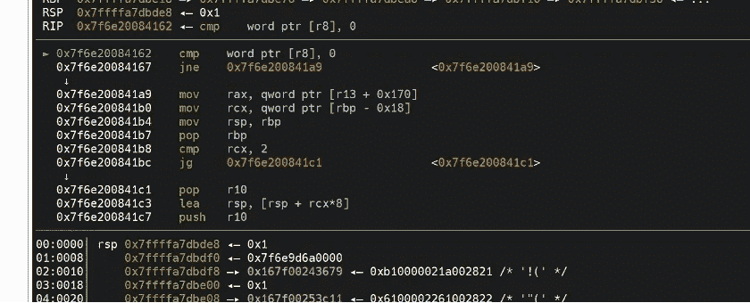

*图 2:数组* ***中的访问违规 a****0x7f 71576 a 0000*

当 PoC 代码第一次调用运行时函数 *gc()，*然后是 *cmpw [r8]，0* 会比较如图 3 所示。

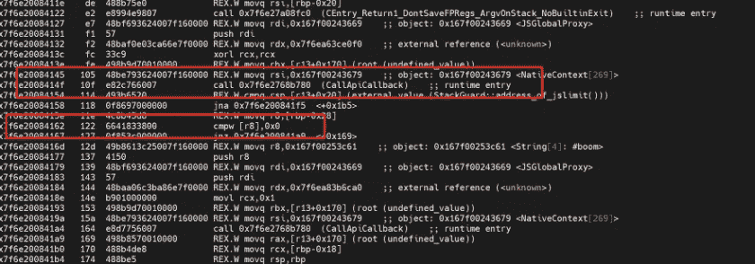

图 3:调用 gc()时的汇编指令

**漏洞的原因**

在前两次运行 PoC 代码时，v8 知道数组 **a** 的使用，其作用域在声明它的块的本地，并且数组 **a** 随后将不会被访问。因此，在优化编译阶段， *gc()* 回收存储在 v8 数组中的内存，数组 **a** 的内存被释放。

但是，在这种情况下，v8 为 x64 平台生成了不明确的指令: *cmp [r8]，0* (r8 直接指向数组 a 的内存地址)。参考清单 1，这条指令对应的语句是:if(b)，正常情况下，执行步骤 2 时， **b** 默认为布尔值，在步骤 4 不需要再次访问数组 **a** 的内存，但是由于 v8 中为了优化的改变，为了减少地址注册表的查找，在这种情况下，直接与内存位置进行比较。

优化流程:

*if(b)= > if(a[0]！=0)= > Word32Equal(a[0]，0) = > [cmp [r8]，0；jnz xxxx]*

因此，当执行步骤 4 时，它正在访问已经回收的同一个位置，导致地址 0x7f6e29984162 处的内存访问异常，其中已经释放的数组 **a** 的内存被再次访问，导致内存损坏和崩溃。

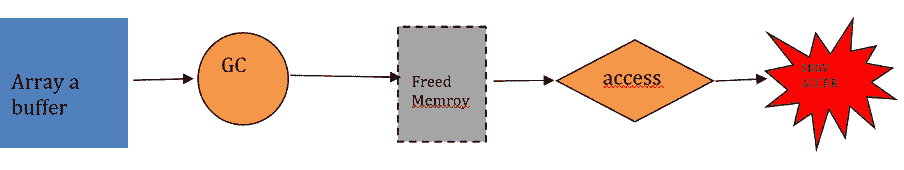

*图 4:漏洞跳跳虎流程图*

**漏洞代码修复分析**

此次修复已经移除了 CanCoverForCompareZero 函数的使用，并恢复了 CanCover 函数的使用。

让我们分析一下修复了该问题的代码行:

[https://chromium . Google source . com/V8/V8/+/71 a9 FCC 950 f1 b 8 efb 27543961745 ab 0262 CDA 7 C4 % 5E % 21/# F0](https://chromium.googlesource.com/v8/v8/+/71a9fcc950f1b8efb27543961745ab0262cda7c4%5E%21/#F0)

```
-// Used instead of CanCover in VisitWordCompareZero: even if CanCover(user,
 -// node) returns false, if |node| is a comparison, then it does not require any
 -// registers, and can thus be covered by |user|.
 -bool CanCoverForCompareZero(InstructionSelector* selector, Node* user,
 — Node* node) {
 — if (selector->CanCover(user, node)) {
 — return true;
 — }
 — // Checking if |node| is a comparison. If so, it doesn’t required any
 — // registers, and, as such, it can always be covered by |user|.
 — switch (node->opcode()) {
 -#define CHECK_CMP_OP(op) \
 — case IrOpcode::k##op: \
 — return true;
 — MACHINE_COMPARE_BINOP_LIST(CHECK_CMP_OP)
 -#undef CHECK_CMP_OP
 — default:
 — break;
 — }
 — return false;
 -}
 -
 } // namespace

 // Shared routine for word comparison against zero.
 @@ -2516,7 +2494,7 @@
 cont->Negate();
 }

 — if (CanCoverForCompareZero(this, user, value)) {
 + if (CanCover(user, value)) {
 switch (value->opcode()) {
 case IrOpcode::kWord32Equal:
 cont->OverwriteAndNegateIfEqual(kEqual);
 @@ -2536,7 +2514,7 @@
 case IrOpcode::kWord64Equal: {
 cont->OverwriteAndNegateIfEqual(kEqual);
 Int64BinopMatcher m(value);
 — if (m.right().Is(0) && CanCover(user, value)) {
 + if (m.right().Is(0)) {
 // Try to combine the branch with a comparison.
 Node* const eq_user = m.node();
 Node* const eq_value = m.left().node();
 @@ -2646,6 +2624,7 @@
 break;
 }
 }
 +
 // Branch could not be combined with a compare, emit compare against 0.
 VisitCompareZero(this, user, value, kX64Cmp32, cont);
 }
```

许多人会问为什么前面的函数没有给出正确的结果？CanCoverForCompareZero 用于确定该位置是否可以生成优化的与零比较的指令序列。相当于 VisitWordCompareZero 函数中 canCover 的增强版。在 VisitWordCompareZero 比较操作位置中处理这种情况，v8 开发者认为，如果 canCover 返回 false，该位置用于比较操作，那么就不需要其他注册表。

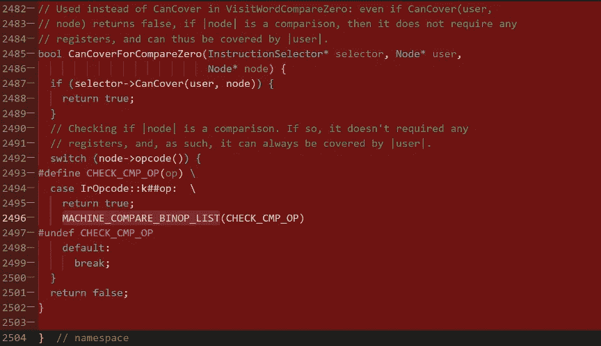

正常情况下，这不是问题。但是，当生成的指令没有先获得比较结果，然后使用比较结果进行比较，而是再次访问数组 **a** 的内存，然后执行 cmp 时，就会出现问题。在这种情况下，所访问的内存被 gc 释放，从而导致 UAF 问题。

下面显示了访问 **a** 的数组缓冲区的函数调用的代码片段:

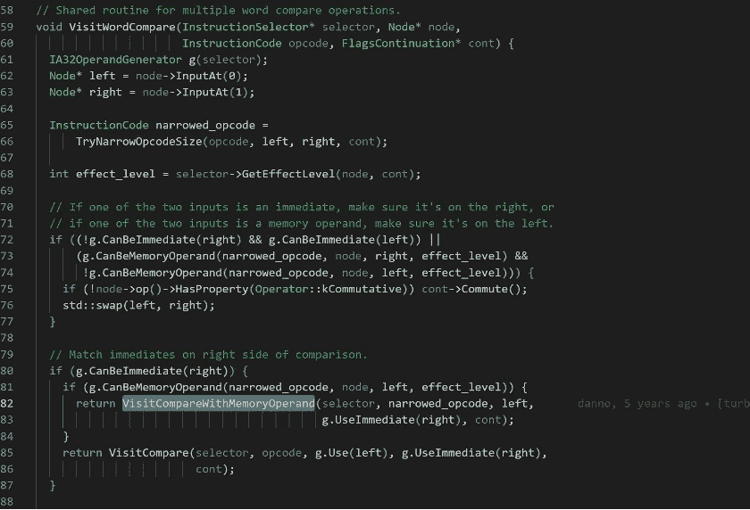

下面显示了触发特定指令的代码片段:

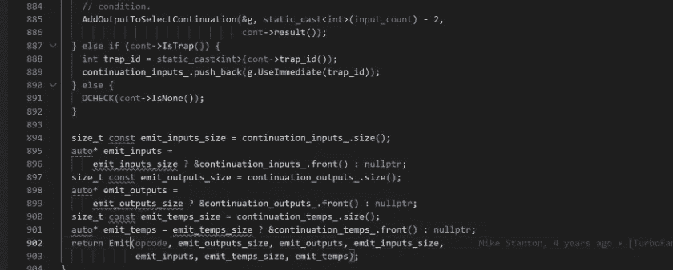

因为易受攻击的代码采用 CanCoverForCompareZero 为真的路径，这导致生成不同的指令序列(易受攻击版本与固定版本)。

**指令序列的详细分析**

在分析了涡扇发动机的优化阶段后，我们知道问题发生在后两个阶段:

在调度阶段，节点信息是完全一致的，但之后就变得不一样了，我们找到了相关的指令序列。

其实对应的 js 代码是 const b=a[0]！=0;

修复前:

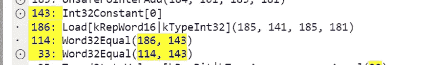

修复后:

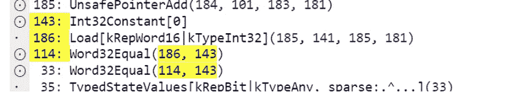

乍一看好像完全一样，但是由于漏洞的原因，这里生成的代码是不一样的(注意 114 的左侧，fix 之前是一个点，fix 之后是一个圆和一个点，也就是说在 fix 之前的 114 行并不是直接生成的指令，而是从 33 个输入中取出来生成一个优化的指令序列——指令折叠。

在易受攻击的代码中，当调用 VisitWordCompareZero 时，CanCoverForCompareZero 将返回 true，因为 Word32Equal 节点是比较类型位置。由于后续访问是一条 cmp 指令，v8 不需要在注册表中存储比较的结果，而是假设后续访问(即 if(b)语句)可以再次直接访问数组 **a** 的内存，最终生成包含更少指令序列的优化代码。

这是在注册表分配之前发生的情况:

修复前:

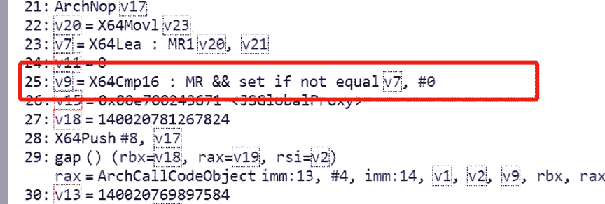

修复前生成的相关指令:

```
· ba xorl r9,r9· bd cmpw [r8],0x0 *# X64cmp16 generates cmpw instructions on x64 platforms*· c2 setnzl r9l *#set flag*
```

修复后:

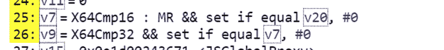

修复后生成的相关说明:

生成 25 行指令序列:

```
· ba cmpw [r8],0x0 # *X64cmp16 generates cmpw instructions on x64 platform*· bf setzl r8l *#set flag*· c3 movzxbl r8,r8 *# the result of the comparison stored in r8*
```

生成 26 行指令序列:

```
· c7 xorl r9,r9· ca cmpl r8,0x0 *# x64cmp32 generates cmpl*· ce setzl r9l *#set flag*
```

对比 fix 前后的 2 组指令，条件指令的区别是相反的像 so *setnzl VS setzl* 因为 fix 之前的代码执行了函数 VisitWordCompareZero 中的 cont->overwritednegateifeequal(ke qual)。

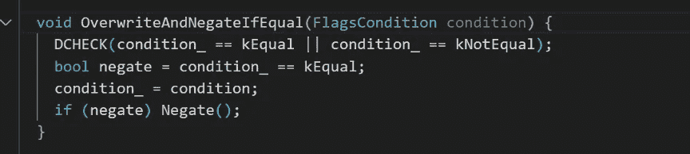

下面显示了漏洞修复后的涡扇装配指令(注意，生成的代码指令序列比修复前长):

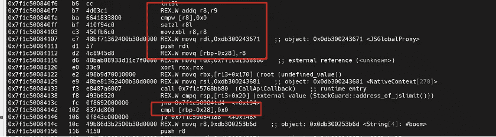

图 5:漏洞修补后的涡扇发动机装配说明

在图 5 中，我们可以看到，比较结果首先放在堆栈[rbp-0x28]中，然后[rbp-0x28]与 0 进行比较，在这种情况下，它不会访问 gc 中的内存，因此不会出现 UAF 问题。

# 开发理念

此漏洞可以使用堆喷涂技术进一步利用，然后导致“类型混淆”漏洞。该漏洞允许攻击者控制函数指针或将代码写入内存中的任意位置，并最终导致代码执行。

# 关于作者

王伟波(诺兰)是一名安全研究员，目前在新加坡网络安全公司 [Numen 网络技术](https://numencyber.com/)工作。他在著名的区块链项目中发现了许多关键漏洞，如 ETH、EOS、Ripple、TRON 以及苹果、微软、谷歌等公司的热门产品