# ZH3R0 CTF —挑战报道

> 原文：<https://infosecwriteups.com/zh3r0-ctf-challenge-writeups-fe0ef9027457?source=collection_archive---------2----------------------->

大家好，我是 zh3r0 CTF 团队的一员。我们成功举办了第一届 CTF。我希望你喜欢 CTF 的活动。所以，我在 zh3r0 CTF 做了 4 个挑战。其中，3 个是辩论类，1 个是网络类。

# 猫猫挑战赛(法医)

> 凯蒂试图找到旗子，但是她很懒。你能帮她找到旗子吗？
> 
> 作者:cryptonic007

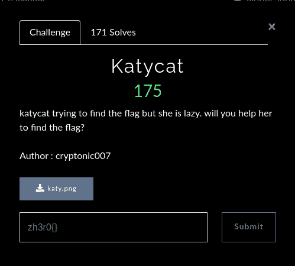

首先，下载 png 文件。这是一个 png 文件。让我们运行 png stegano 工具。

我运行了 **zsteg** 工具，发现了一个可疑的链接。

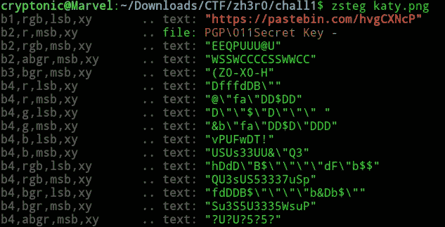

让我们访问链接。我在 base64 找到了些东西。

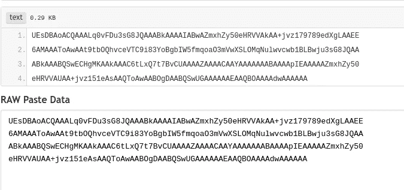

让我们转换成 zip 文件。我拿到了压缩文件。下载 zip 文件。

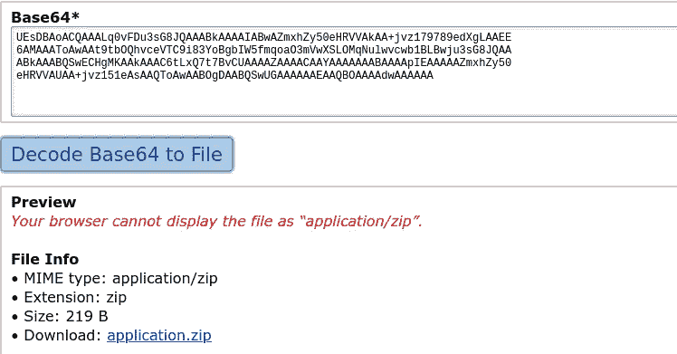

我试着打开 zip 文件，但它有密码保护。所以，我们来找密码。我运行 fcrackzip 来查找密码。

使用密码打开拉链。我们得到了 flag.txt。我打开文件，发现一些不可读的文本，也许它被编码在什么东西里。也许，是腐烂。让我们弄清楚。

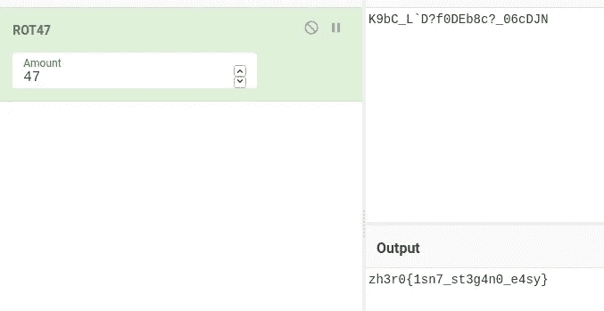

这是 rot47 和嘣…我们拿到旗子了。

> **Flag:zh3r 0 { 1sn 7 _ st3g4n 0 _ e4sy }**

# 2.是巨魔吗？(法医)

> 有一把婴儿钥匙，婴儿把钥匙藏在某个地方。你能帮他父亲找到钥匙吗？？
> 
> 作者:cryptonic007

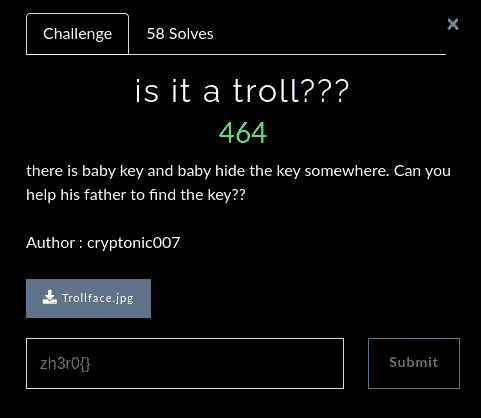

先下载 jpg 文件，试着找点有价值的。所以，我先运行 Exiftool，看看能找到什么。

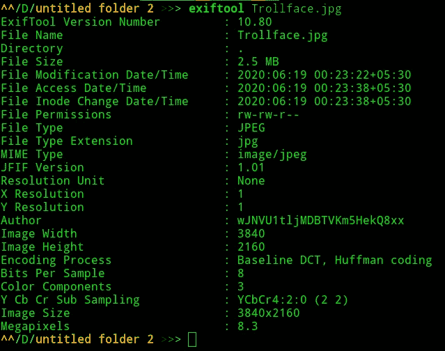

在作者姓名中，我们发现了一个编码字符串。我们来解码吧。

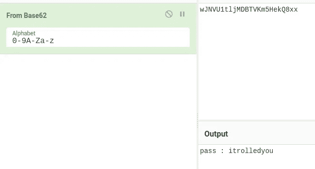

我们拿到密码了。可能使用了隐藏工具。让我们试着提取文件。

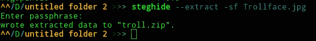

所以，我们有 troll.zip。让我们打开它。

我解压 zip 文件，找到一个 png 文件，例如 troll.png。让我们试着找些东西。

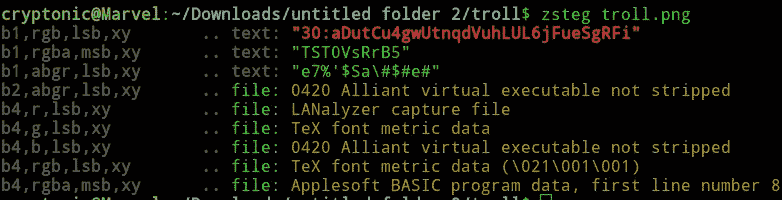

我找到了一个编码字符串。我们来解码吧。

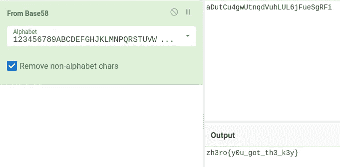

万岁…..！我们拿到旗子了。

> **旗:zh3ro{y0u_got_th3_k3y}**

# **3。找到 covid19 疫苗(取证)**

> 在某个地方有疫苗。发现它
> 
> 作者:cryptonic007

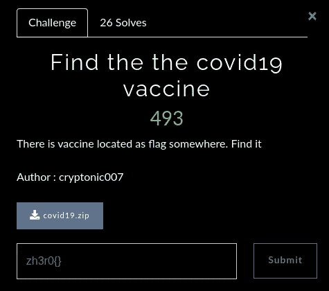

首先，下载 zip 文件。我解压 zip 文件，发现了 30 个 jpg 文件和一个 pdf 文件。但是，后来我仔细看了看，发现在 jpg 文件之间有一个 png 文件。它看起来很可疑，我想在 png 文件中有一些东西。我试着找些东西。我在一个 png 文件上运行 stegsolve 得到了密码。

我检查过了，pdf 有密码保护。所以，我用密码打开了 pdf。在 pdf 中，最后，我发现了一些奇怪的文字，它们看起来很可疑。所以，我开始尝试从中得到一些东西。

现在复制文本，如果你不能正确复制，那么使用在线 pdf 浏览器。复制文本并粘贴，然后您将获得 Unicode 值。解码 Unicode 值，您将获得字符串。

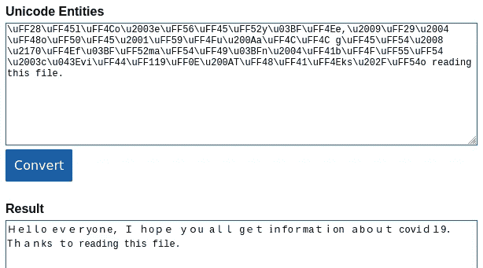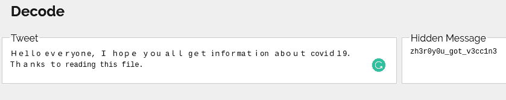

嘣…你得到了旗手。

> **Flag:zh3r 0 { y0u _ g0t _ v3c C1 n 3 }**

# 4.社会(网络)

> chall Link:[http://web.zh3r0.ml:6565/](http://web.zh3r0.ml:6565/)
> 我讨厌这个社会。
> 
> 作者:Cryptonic007，芬奇
> 
> 允许使用自动化工具。

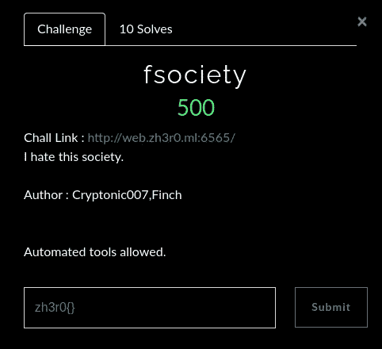

打开给定的 URL。你将一无所获。现在，查看 robots.txt

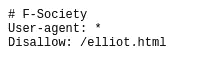

我们得到了 elliot.html。让我们检查一下 elliot.html

现在检查文件的源代码。我们得到了下面的图像代码。

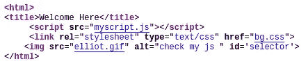

它在说检查我的 js。有 js 文件。让我们打开它。

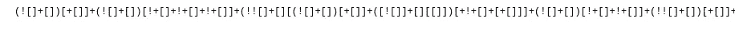

它看起来像 jsfuck 代码。我们来解码吧。

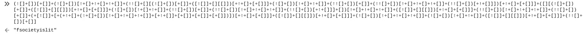

我们得到了类似于**fsocietyslit**的东西。把它记在笔记里。让我们现在运行 dir buster。

我运行 dirbuster。但是，它阻塞并给出 503 错误。所以，我用 Wfuzz 做了 URL 枚举。我明白了。

> http://web.zh3r0.ml:6565/code/

我打开目录，找到了 flag.php 的文件。我打开 flag.php 找到了这个。

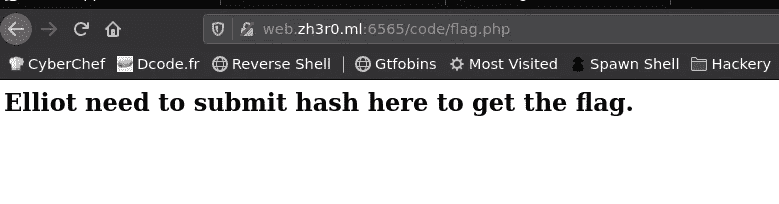

也就是说，我们需要提交代码来获得旗帜。也许 **fsocietyislit** 就是代码。让我们试试

我使用 curl 请求发送 post 代码请求。

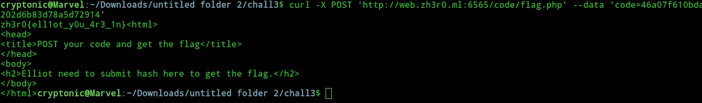

嘣…我们拿到旗子了。

> **Flag:zh3r 0 { ell1ot _ y0u _ 4r 3 _ 1n }**

# 我希望你们都喜欢 CTF。谢谢你演奏 CTF。

> 你可以在 Instagram 和 Twitter 上关注我。

Twitter — [mohitkchandani](https://twitter.com/mohitkchandani)

insta gram—[cryptonic 007](http://instagram.com/cryptonic007)