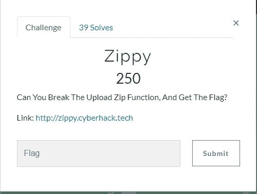
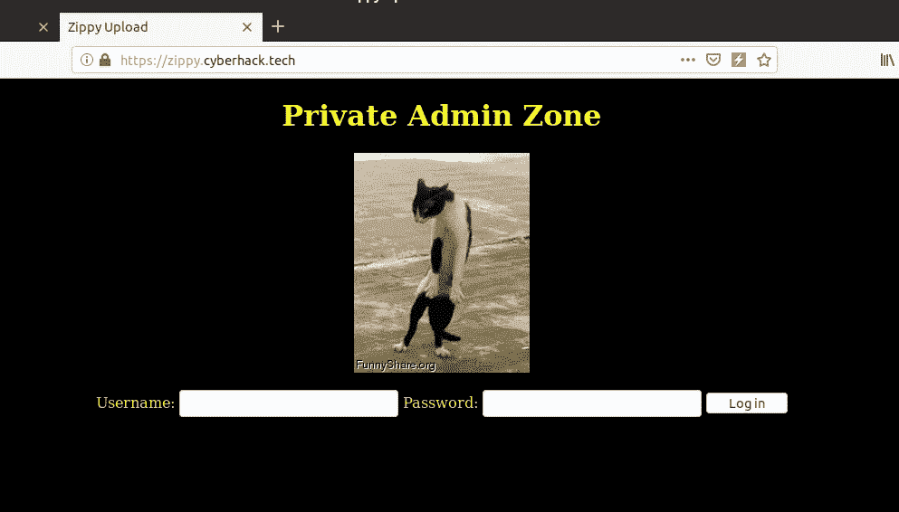
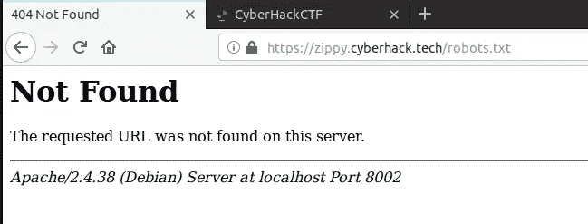
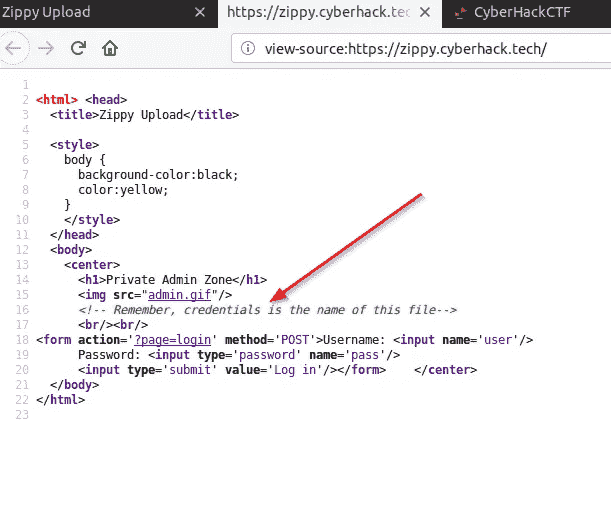
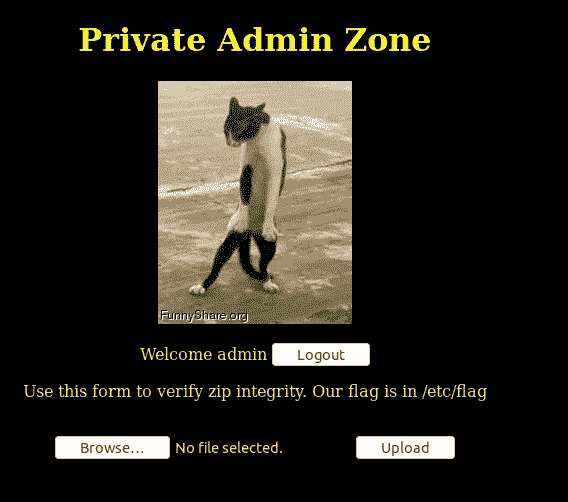
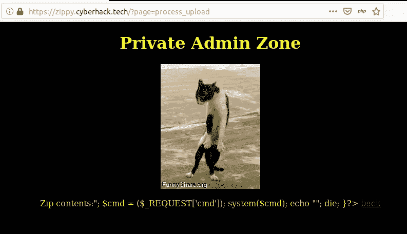
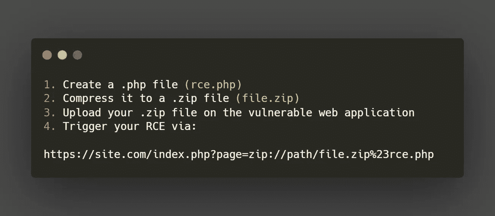
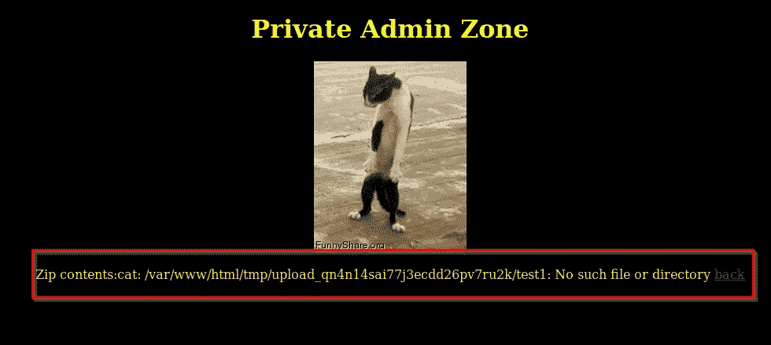
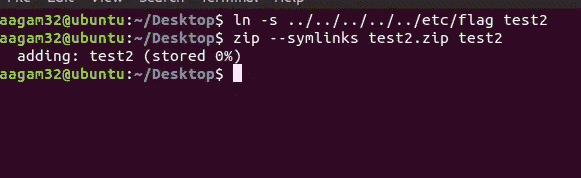
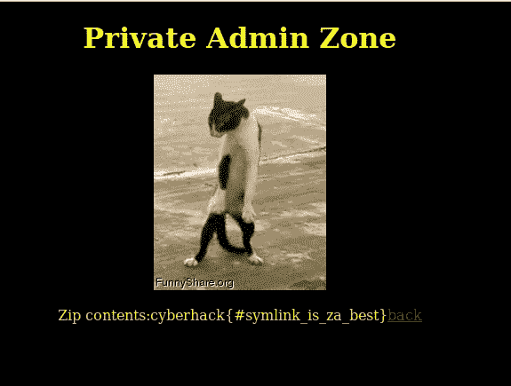

# CTF 网络黑客大挑战

> 原文：<https://infosecwriteups.com/zippy-challenge-writeup-cyberhack-ctf-80eb1d422249?source=collection_archive---------0----------------------->

Zippy 是网络黑客 CTF 在网络类别下面临的挑战之一。这是一个非常有趣的挑战，因为我们需要利用 PHP zip 文件解析器来获取我们的标志。由于 web 应用程序经常处理 zip 文件，这个挑战非常接近于现实世界的场景。

活力挑战

所以，挑战陈述了我们能破坏上传 zip 功能，并且提供了挑战的 URL。当访问这个网址时，它显示了这样一个页面。

快速登录

它要求用户名和密码，这里的解决方案是一种情况，但如何采取这样的挑战也是重要的一部分。我会试着解释我的想法。所以，CTF 的第一件事就是检查网络服务器上的公共文件。有时候这对你来说很容易。我首先检查了这个 URL 上的 robots.txt 文件。

robots.txt

文件不存在，但我们仍然想登录到这里，这样我们就可以上传我们的 zip 文件进行检查。所以接下来的事情是检查这个页面的来源。

查看页面源

有一个注释告诉我们凭证是这个文件的名称，而页面源代码中只有一个名为“ **admin.gif** 的文件，所以我们的用户名和密码是 admin。

上传页面。

我登录了，现在有一个上传文件选项和一个提示，说明标志在/etc/flag 文件中。因此，我们的目标是读取该文件以获取我们的标志。所以，我很快压缩了一个简单的 php shell 并上传到这个页面。

Shell 上传

它只是显示了我上传的 zip 文件中的文件内容。接下来我想到的是尝试用 zip:// filter 读取一个文件。米语证券公司不久前发布了一个技巧。

参赛:https://twitter.com/yumi_sec/status/1253620834691887105

zip:// filter trick。

这个挑战没有成功，因为管理员可能根本没有保存上传的文件。那么，发生了什么事，zip 文件被解压缩，其中的文件只是显示(猫)在输出中。

搜索了一段时间后，我知道了一个叫做**“Zip Slip”**的问题，它显示了用各种语言编写的 Zip 文件解析器中的问题。因此，这种利用就像将文件放入一个 zip 文件中，该文件带有特制的文件名，例如:**"../etc/passwd"** 当 zip 解析器提取它时，会导致服务器后端的文件路径遍历。你可以在这里阅读更多关于滑码的信息。

 [## Snyk - Zip Slip 漏洞

### Zip Slip 是一个广泛存在的任意文件覆盖关键漏洞，通常会导致远程命令…

snyk.io](https://snyk.io/research/zip-slip-vulnerability) 

现在，我搜索了如何创建一个名为“的文件../../etc/flag "因为这是我们的目标。我开始知道我们可以使用符号链接来做到这一点。之后，我们可以在 zip 命令中使用“symlinks”标志将该符号链接添加到 zip 文件中。

首次测试

一旦上传，它给出了一个路径错误。

路径错误

在这里，我们可以看到我们上传的文件的完整路径得到显示，并显示类似“没有这样的文件或目录”的错误。出现这个错误是因为我们不在标志目录中，但我们需要往回遍历更多。所以，第二个有效载荷是**../../../../../etc/flag"**

第二有效载荷

同样的过程压缩和上传文件，手指交叉。

旗

它工作了，我们得到了我们的标志文件内容。所以国旗。这可以肯定是一个真实世界的场景。为了避免这种情况，可以在解压 zip 文件时适当地清理文件名中的特殊字符。

感谢 CyberHack CTF 团队设置了这个。！！

祝你愉快！！黑客快乐！！