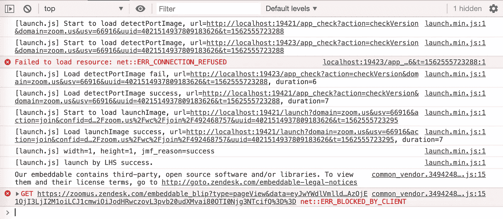
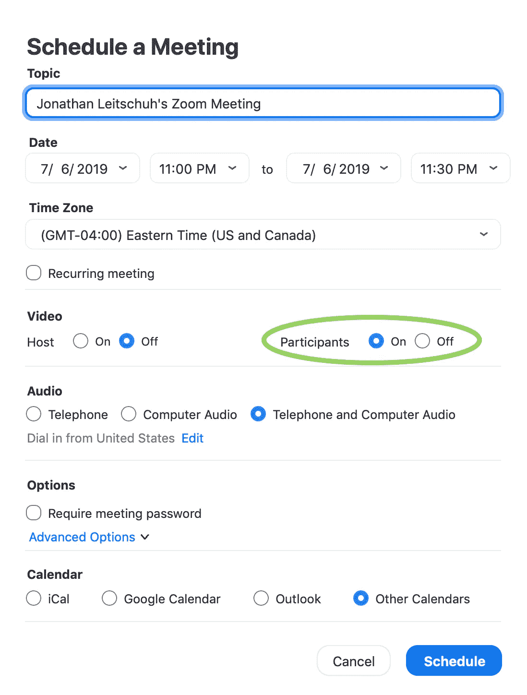
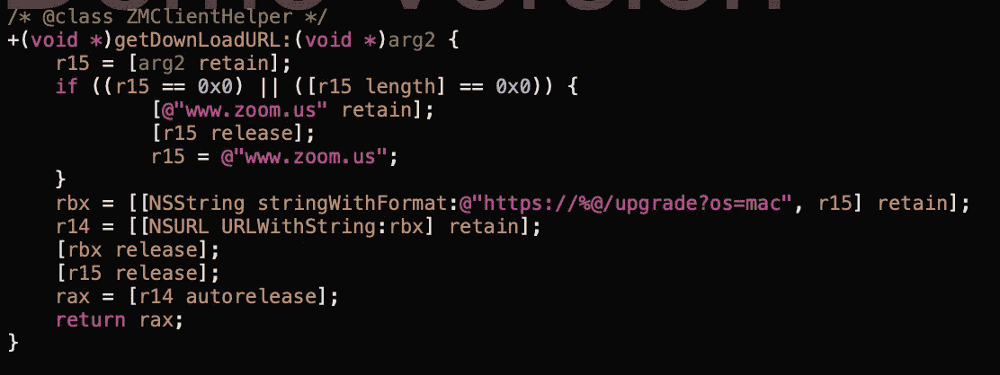
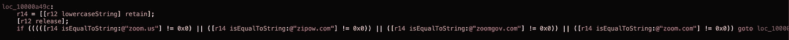
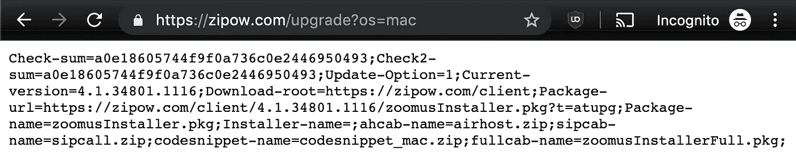
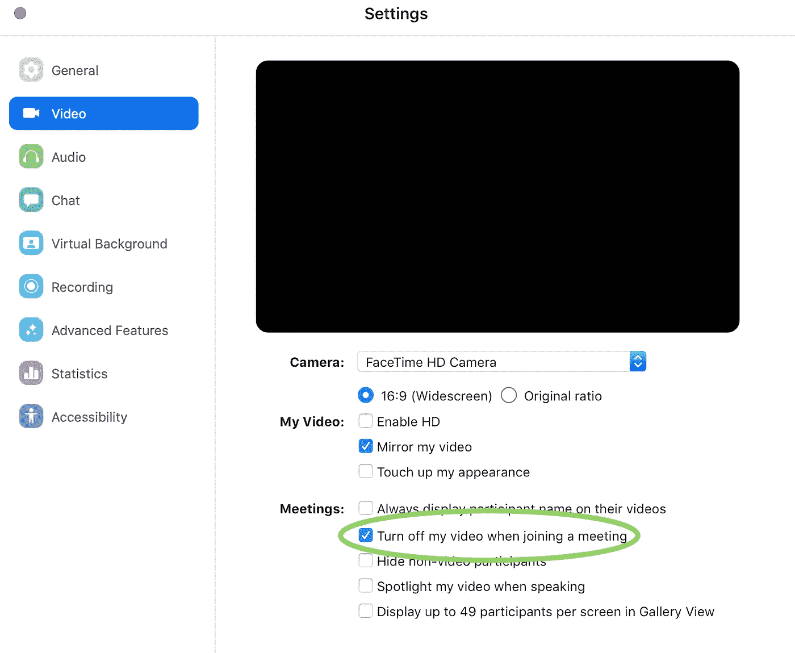

# zoom Zero Day:400 多万网络摄像头&也许是 RCE？只要让他们访问你的网站！

> 原文：<https://infosecwriteups.com/zoom-zero-day-4-million-webcams-maybe-an-rce-just-get-them-to-visit-your-website-ac75c83f4ef5?source=collection_archive---------0----------------------->

## Mac Zoom 客户端中存在一个漏洞，使得任何恶意网站能够在未经您允许的情况下启用您的摄像头。该漏洞可能会暴露全球多达 75 万家使用 Zoom 开展日常业务的公司。

# CVE 数字

*   DOS 漏洞-客户端版本 4.4.2 中已修复—[CVE-2019–13449](https://cve.mitre.org/cgi-bin/cvename.cgi?name=CVE-2019-13449)
*   信息泄露(网络摄像头)—未修复—[CVE-2019–13450](https://cve.mitre.org/cgi-bin/cvename.cgi?name=CVE-2019-13450)

# 更新—7 月 9 日上午

据我所知，这个漏洞也会影响 Ringcentral。他们的网络会议系统 Ringcentral 是一个贴有白色标签的缩放系统。

# 更新—7 月 9 日下午

据 Zoom 称，他们将在太平洋时间今晚午夜前发布修复程序，移除隐藏的网络服务器；希望这修补了这个漏洞最明显的部分。Zoom 首席执行官也向我们保证，他们将更新他们的应用程序，以进一步保护用户的隐私。

# 更新—7 月 15 日

如果您已将 Zoom 更新到最新版本，现在会看到这个新的 UI，确认您确实想要加入会议。

# 更新—7 月 17 日

自从[曝光以来，Zoom 及其 13 个白标应用包含一个远程代码执行(RCE)漏洞](https://blog.assetnote.io/bug-bounty/2019/07/17/rce-on-zoom/)。Zoom、RingCentral、Telus Meetings、BT Cloud Phone Meetings、Office Suite HD Meeting、AT&T Video Meeting、BizConf、惠惠、UMeeting、朱穆、Zoom CN、EarthLink Meeting Room、Video Conferencia Telmex、& Accession Meeting。从那以后，苹果通过使用 MRT 悄悄地从你的电脑上删除了这些应用程序。

# 序

该漏洞允许任何网站在未经用户许可的情况下，在用户的摄像机被激活的情况下，强行将用户加入缩放呼叫。

最重要的是，该漏洞通过重复将用户加入无效呼叫，允许任何网页拒绝服务 Mac。

此外，如果你曾经安装了 Zoom 客户端，然后卸载了它，你的机器上仍然有一个`localhost` web 服务器，它会很乐意为你重新安装 Zoom 客户端，除了访问网页之外，不需要任何用户交互。这个重新安装的“功能”一直持续到今天。

是的，不是开玩笑。

该漏洞利用了令人惊讶的简单缩放功能，您可以向任何人发送一个会议链接(例如`https://zoom.us/j/492468757`)，当他们在浏览器中打开该链接时，他们的缩放客户端会在他们的本地计算机上神奇地打开。我很好奇这个神奇的功能是如何实现的，又是如何安全实现的。我发现，它真的没有被安全地实现。我也想不出一个不需要额外的用户交互来保证安全的好方法。

该漏洞最初于 2019 年 3 月 26 日被负责任地披露。这份初步报告提出了一个“快速修复”Zoom 的描述，只需简单地改变其服务器逻辑即可实现。Zoom 花了 10 天时间来确认漏洞。关于如何修补漏洞的第一次实际会议发生在 2019 年 6 月 11 日，距离 90 天公开披露截止日期仅 18 天。在这次会议中，漏洞的细节得到了确认，Zoom 计划的解决方案也得到了讨论。然而，我很容易就能在计划好的修复中发现并描述旁路。此时，Zoom 还有 18 天的时间来解决这个漏洞。6 月 24 日，经过 90 天的等待，也就是公开披露截止日期前的最后一天，我发现 Zoom 只实施了最初建议的“快速修复”解决方案。

最终，Zoom 未能迅速确认所报告的漏洞确实存在，也未能及时向客户提供问题的修复程序。这样一个拥有如此庞大用户群的组织应该更加主动地保护其用户免受攻击。

# 时间表

*   2019 年 3 月 8 日—通过 Twitter 请求安全联系(无响应)。
*   2019 年 3 月 26 日—通过电子邮件联系 Zoom Inc，公开披露期限为 90 天。提供了一个“快速修复”的解决方案。
*   2019 年 3 月 27 日
    -请求确认接收。
    ——通知 Zoom 安全工程师不在办公室。
    -根据漏洞修补后不能公开披露的政策，提出并拒绝了对该报告的奖金。
*   2019 年 4 月 1 日—请求确认漏洞。
*   2019 年 4 月 5 日 Zoom 安全工程师确认并讨论严重性的回复。最终确定 [CVSSv3 得分 5.4/10](https://nvd.nist.gov/vuln-metrics/cvss/v3-calculator?vector=AV:N/AC:L/PR:N/UI:R/S:U/C:L/I:N/A:L) 。
*   2019 年 4 月 10 日 Chromium 安全团队发现漏洞。
*   2019 年 4 月 18 日—根据 Chromium 团队的建议更新了 Zoom。
*   2019 年 4 月 19 日—向 Mozilla FireFox 安全团队披露的漏洞。
*   2019 年 4 月 26 日—与 Mozilla 和 Zoom 安全团队的视频通话
    披露了即将到期的 DNS 的详细信息。
*   2019 年 6 月 7 日 Zoom 关于讨论修复的视频电话的电子邮件。
*   2019 年 6 月 11 日—与 Zoom 安全团队就即将到来的披露进行视频通话。讨论了 Zoom 的计划补丁是如何不完整的。
*   2019 年 6 月 20 日—就与 Zoom 安全团队进行另一次视频通话一事联系。由于日历冲突，被我拒绝。
*   2019 年 6 月 21 日— Zoom reports 漏洞已修复。
*   2019 年 6 月 24 日— 90 天公开披露截止日期结束。通过“快速修复”解决方案确认修复了漏洞。
*   2019 年 7 月 7 日-修复中的回归导致摄像机漏洞再次工作。
*   2019 年 7 月 8 日
    -回归修复。
    -发现了解决方法&披露。
    -公开披露。

# 细节

在 Mac 上，如果你曾经安装过 Zoom，你的本地机器上有一个 web 服务器运行在端口`19421`上。您可以通过在终端中运行`lsof -i :19421`来确认该服务器是否存在。

首先，让我先说，在我的本地机器上安装一个运行 web 服务器的应用程序，并使用一个完全没有文档记录的 API，对我来说是非常粗略的。其次，我访问的任何网站都可以与我机器上运行的 web 服务器进行交互，这对于我这个安全研究员来说是一个巨大的危险信号。

这是 Zoom 网站上的代码，它让我知道了这个本地主机服务器。

当我得知这个 web 服务器存在时，我最初的想法是，如果这个 web 服务器的参数处理中有缓冲区溢出，有人可以在我的机器上实现 RCE。那不是我发现的，但那是我最初的思考过程。

如果您在访问其中一个 Zoom“join”链接时查看 web developer 控制台中记录的内容，您应该会看到如下内容:

访问`[https://zoom.us/j/492468757](https://zoom.us/j/492468757)`时的浏览器控制台日志

我还发现，这个页面不是发出常规的 AJAX 请求，而是从本地运行的 Zoom web 服务器加载图像。图像的不同尺寸决定了服务器的错误/状态代码。您可以在这里看到大小写转换逻辑。

这两个数字是 web 服务器返回的图像的像素尺寸。

可怕的是，这个枚举似乎表明，这个 web 服务器可以做的远不止是启动一个缩放会议。我发现，如果用户卸载了 Zoom 应用程序，这个 web 服务器也可以重新安装它，稍后会详细介绍。

我问的一个问题是，为什么这个 web 服务器返回以图像文件的尺寸编码的数据？原因是，这样做是为了绕过[跨产地资源共享(CORS)](https://en.wikipedia.org/wiki/Cross-origin_resource_sharing) 。出于有意的原因，浏览器会明确忽略本地主机上运行的服务器的任何 CORS 策略。

> Chrome [不支持 CORS 请求](http://code.google.com/p/chromium/issues/detail?id=67743)的本地主机(自 2010 年以来的一个公开缺陷)。
> -[https://stack overflow . com/questions/10883211/deadline-CORS-when-http-localhost-is-the-origin](https://stackoverflow.com/questions/10883211/deadly-cors-when-http-localhost-is-the-origin)

我猜这是出于安全原因故意这样做的。不管怎样，Zoom 似乎在滥用黑客技术绕过 CORS 的保护。稍后会详细介绍。

## 视频通话漏洞

我用不同的帐户创建了一个个人会议，打开了 [Postman](https://www.getpostman.com/) ，并开始移除参数，以查看启动缩放会议所需的最小 GET 请求是什么。

有许多随机参数被发送到本地主机 web 服务器，但似乎唯一重要的参数如下。

*   动作=加入
*   confno =[无论会议号码是多少]

使用下面来自 Postman 的 GET 请求，我成功地让我的计算机加入了另一个帐户创建的 Zoom call。

一旦有了这个，我就开始修改其他“动作”参数，我可以传递这些参数来让客户机做其他事情。即使在搜索了各种公开文档和公开的 ProtoBuff 模式以寻找可能存在的隐藏功能的线索之后，我也没有找到任何东西。再说一次，据我所知，这个 web 服务器的 API 是完全没有文档记录的，我花了几个小时在官方和非官方文档中搜索任何关于这个桌面 web 服务器的内容。

因此，现在我有了一个最小的 POC，我可以用它来恶意地让任何用户加入呼叫，但是,“新会议”的默认设置是允许用户选择是否加入他们的音频/视频。我认为这本身就是一个安全漏洞。

> 上述行为延续至今！您仍然可以利用这一漏洞未经他人允许就发起呼叫。

我了解到 Zoom 安全漏洞中的[可远程执行代码，该漏洞仅在过去 6 个月内得到修补。如果 Tenable 漏洞与此漏洞相结合，它将允许 RCE 攻击任何安装了 Zoom Mac 客户端的计算机。如果将来发现类似的漏洞，它将允许互联网上的任何网站在用户的机器上实现 RCE。](https://www.tenable.com/blog/tenable-research-advisory-zoom-unauthorized-command-execution-cve-2018-15715)

我建议 Zoom，如果他们有任何用户仍在使用 Zoom 4.1.33259.0925 或更低版本，这将是一个非常强大的攻击。

到目前为止，我只能在未经用户允许的情况下让他们加入通话。虽然这有假设的安全隐患，但我没有真正的利用。我开始琢磨如何激活某人的相机。在安排工作会议时，我看到了这个屏幕。

您可以选择在参与者加入呼叫时启用他们的摄像机。

启用“参与者:开启”设置会议时，我发现任何加入我的会议的人都会自动连接到他们的视频。

当我回到我的个人电脑时，我尝试了同样的功能，发现它完全一样。

这促使我创建了下面的概念证明。

**概念验证**

本地客户端 Zoom web 服务器作为后台进程运行，因此要利用这一点，用户甚至不需要“运行”(传统意义上)Zoom 应用程序就容易受到攻击。

一句台词，真的就这么简单。

或者，如果您希望激活摄像机，只需在您的站点中嵌入一个带有 iframe 的 Zoom join 链接。

所有网站需要做的就是将上述内容嵌入到他们的网站中，任何 Zoom 用户都会立即连接到他们的视频运行。**今天依然如此！**

这可能被嵌入恶意广告中，或者被用作网络钓鱼活动的一部分。如果我真的是一个攻击者，我可能会花一些时间在 Zoom 网站上运行的 Javascript 代码中加入增量端口逻辑。

您可以在下面的链接中找到一个完全可用的 POC，您可以自己进行测试。**警告:**在 Mac 上点击这个链接会让你进入缩放通话！
[https://jlleitschuh.org/zoom_vulnerability_poc/](https://jlleitschuh.org/zoom_vulnerability_poc/)

可以在此处找到一个完全正常工作的 POC，它将在摄像机处于活动状态的情况下启动您的通话**。**警告:**在 Mac 上点击此链接将启动变焦通话，同时激活您的相机！
[https://jlleitschuh . org/zoom _ vulnerability _ POC/zoom pwn _ iframe . html](https://jlleitschuh.org/zoom_vulnerability_poc/zoompwn_iframe.html)**

**快速修复**

为了修复漏洞的“自动加入视频”部分，我建议 Zoom 在他们的后端服务器上立即禁用会议创建者默认自动启用参与者视频的功能。我建议这是 100%，而不是一个完整的修复。然而，它可以作为一种快速的方法来保护用户免受这种攻击的侵犯隐私部分。

我还建议，如果有隐藏的功能，会议主持人可以强行加入计算机音频(也许我没有看到，因为我没有专业帐户)，这也应该被禁用。

我评论说，允许主持人选择参与者是否自动加入视频应该被认为是它自己独立的安全漏洞。

对此建议，我收到了以下回复:

> Zoom 相信我们的客户有权选择他们想要的缩放方式。这包括他们是否希望在自动启用麦克风和视频的情况下无缝加入会议，或者他们是否希望在加入会议后手动启用这些输入设备。此类配置选项在 Zoom Meeting 客户端音频和视频设置中可用。
> 
> 但是，我们也认识到一些客户希望在参加会议之前有一个确认对话框。根据您的建议和其他客户的功能请求，Zoomteam [sic]正在评估此类功能的选项，以及对用户输入设备设置的额外帐户级别控制。我们一定会让你知道我们在这方面的计划。

当回应负责任的披露时，不要进入公关旋转模式。适得其反。

值得注意的是，变焦的默认配置是允许主持人选择默认情况下是否启用您的相机。

Zoom 最终确实修补了这个漏洞，但他们所做的只是阻止攻击者打开用户的摄像机。他们没有禁用攻击者强行加入任何访问恶意站点的人的呼叫的能力。

更新:2019 年 7 月 7 日:Zoom 实施的修复中出现了一个回归，从而允许在激活摄像机的情况下利用该漏洞。

## 拒绝服务(DOS)漏洞

这个漏洞还允许攻击者对任何用户的机器进行 DOS 操作。通过简单地向一个错误的号码重复发送 GET 请求，Zoom app 会不断地向操作系统请求“聚焦”。以下简单的 POC 演示了此漏洞。

针对 Mac 上任何 Zoom 用户的 DOS 攻击的概念证明

Zoom client 的 4.4.2 版中修补了此 DOS 漏洞。

## 安装漏洞

如果您曾经在计算机上安装过 Zoom，则安装了此 web 服务器。如果您从计算机上卸载 Zoom，它将继续运行。

除了发起呼叫之外，该服务器还支持更新和安装新版 Zoom。我对 Zoom web 服务器做了一些额外的反编译，以查看这些端点似乎调用的代码路径。

使用 Hopper 反汇编程序来反汇编 web 服务器的 Objective-C 字节码，我发现了下面的方法。

从一些 API 请求中获取参数，并使用它来创建一个用于升级 Zoom 安装版本的下载 URL。

该方法由以下逻辑选通。

确保下载 URL 仅位于“可信”子域下。

在安装了 Zoom 的所有 MAC 上运行的这个 web 服务器内部的一个 API 是一个端点，它允许安装的 Zoom 的当前版本被这个服务器更新或重新安装。

您可以通过执行以下操作来确认此逻辑确实存在:

1.  如果尚未安装 Zoom client，请在您的计算机上安装它。
2.  打开缩放客户端，然后将其关闭。
3.  通过将`Applications/zoom.us.app`文件拖到回收站，从您的计算机中卸载 Zoom client。
4.  打开任何 Zoom join 链接，Zoom 将“有益地”重新安装在`Applications`文件夹中，并由该 web 服务器启动。

使用应用程序中列出的可用于下载 Zoom 应用程序更新的域列表，我决定检查并查看每个站点在访问时返回的内容。例如，下面是访问 https://zipow.com/upgrade?os=mac[的结果](https://zipow.com/upgrade?os=mac)

如果需要重新安装 zoom，您可以清楚地看到用于下载 Zoom 安装程序的 URL。

对源代码中列出的所有域进行`whois`查找，返回了一些有趣的结果。例如，域名`zoomgov.com`原定于 2019 年 5 月 1 日到期。如果允许该域注册失效，该域的接管将允许攻击者从该站点托管 Zoom 安装程序的受感染版本，并感染已从其计算机卸载 Zoom 的用户。本质上，这将使此漏洞成为远程代码执行(RCE)漏洞。我在 2019 年 4 月 26 日与 Mozilla 安全团队通话时向 Zoom 团队透露了这一点信息。在通话结束后的 5 小时内，该域名已被注册至 2024 年 5 月 1 日。

## 基本安全漏洞

在我看来，网站不应该这样和桌面应用对话。浏览器应该有一个基本的沙箱来防止恶意代码在用户机器上执行。

让每个 Zoom 用户都有一个接受 HTTP GET 请求的 web 服务器来触发浏览器沙箱之外的代码，这是在 Zoom 的背后画了一个巨大的靶子。值得注意的是，如果您试图通过 Javascript AJAX 请求直接利用相同的漏洞，您会遇到以下异常。

浏览器禁止所有来自 Javascript 本地主机请求。

**CORS-RFC1918**

在与 Chromium 和 Mozilla Firefox 安全团队讨论这个漏洞时，他们都表示对这个漏洞无能为力。Chromium 团队向我推荐了 [CORS-RFC1918](https://wicg.github.io/cors-rfc1918/) ，该提案要求浏览器供应商在允许网站对本地资源(如`localhost`和`192.168.1.*`地址空间)进行请求之前，先询问用户的许可。

该 RFC 中链接了一份精彩有趣的错误报告，其中谷歌 Project Zero 的塔维斯·奥曼迪在趋势科技的密码管理器中发现了一个类似的漏洞，该漏洞允许通过浏览器远程执行代码，并从密码库中泄露用户的密码。那个故事很值得一读。

当同样的漏洞被报告给 Mozilla Firefox 团队时，他们关闭了它，因为它不被认为是针对 Firefox 的漏洞。但是，他们很快就重新打开了该报告，认为这是针对其内部基础架构的一个漏洞。因此，我被邀请参加 2019 年 4 月 26 日与 Zoom 和 Mozilla Firefox 团队的电话会议，讨论该漏洞。在这次通话中，他们向我和 Mozilla 承诺，这个漏洞将在 90 天的披露期限结束之前得到修补。这被证明是错误的。

# Zoom 建议的修复

Zoom 团队提出的解决方案是对提交给客户端的请求进行数字“签名”。然而，这仅仅意味着攻击者必须有一个后端服务器，它首先向 Zoom 站点发出请求以获得有效的签名，然后再将签名转发给客户端。

他们还建议将签名锁定在发出请求的 IP 上。这意味着只要攻击者的服务器与受害者的服务器位于同一 NAT 路由器之后，攻击就仍然有效。

我向 Zoom 团队描述了这两种解决方案不足以完全保护他们的用户。不幸的是，这使得 Zoom 团队在公开披露之前只有 18 天的时间来提出一些更好的解决方案。

不幸的是，即使在我发出警告后，这也是他们选择的解决方案。这个新的签名或令牌被嵌入到一个名为`confid`的新参数中。绕过这个新的`confid`检查的最简单的方法是简单地使用上述的`iframe`解决方法。或者，如果您和受害者位于同一个 NAT 路由器之后，您可以请求加入页面，从 HTML 文档中提取`#lhs_launch_parames`字段，并将其嵌入恶意页面的 HTML 响应中。

# 结论

截至 2015 年[，Zoom 拥有超过 4000 万用户](https://www.globenewswire.com/news-release/2015/02/04/1130354/0/en/Zoom-Raises-30M-in-Series-C-Funding-Led-by-Emergence-Capital.html)。鉴于 Mac 占 PC 市场的 10%，并且 Zoom 自 2015 年以来有显著增长，我们可以假设至少有 400 万 Zoom 用户使用 Mac。像 Zoom、Google Meet 或 Skype for Business 这样的工具是当今现代办公室的必备工具。

拥有如此多用户的应用程序中的任何漏洞都必须被视为对所有这些用户的严重威胁。本报告中描述的所有漏洞都可以通过[“驱动攻击”方法](https://attack.mitre.org/techniques/T1189/)来利用。在我与 Zoom 安全团队的多次交谈中，他们似乎认为这个漏洞的严重性有限，因为它需要“用户交互”来利用这些漏洞。最后，我的回答是“我强烈建议你不要为了保护你的用户而把你的帽子挂在‘需要用户交互’上，因为这种‘用户交互’仅仅是点击一个链接或者访问一个网页。”

我认为，为了充分保护用户，我真的认为这个`localhost` web 服务器解决方案需要删除。其他方法，比如向浏览器注册定制的 URI 处理程序(例如，`zoom://` URI 处理程序)是更安全的解决方案。当这些 URI 处理程序被触发时，浏览器会明确提示用户确认打开应用程序。根据 Zoom 团队的说法，这个`localhost`服务器继续存在的唯一原因是苹果的 Safari 不支持 URI 处理程序。

# 结果

这基本上是一个零日。不幸的是，Zoom 并没有按照行业标准，在我给他们的 90 天披露期内修复这个漏洞。因此，Zoom on Mac 的 400 多万用户现在很容易因为使用这项服务而受到隐私侵犯。

此外，由于缺乏足够的自动更新能力，许多用户在新版本发布后的几个月内继续运行过时版本的 Zoom，从而使他们容易受到此类攻击。

# 修补你自己

如果您想为自己修补此漏洞，您可以执行以下操作。
加入会议时，禁用缩放功能来打开您的网络摄像头。

或者，使用此终端命令。

您也可以使用终端，而不是使用应用程序的 UI 来禁用它。

要关闭 web 服务器，运行`lsof -i :19421`来获取进程的 PID，然后执行`kill -9 [process number]`。然后你可以删除`~/.zoomus`目录来删除 web 服务器应用文件。

要防止此服务器在更新后被恢复，您可以在终端中执行以下操作:

如果你想知道如何在 Windows 和 Mac 上解决这个问题的完整描述，请看下面的要点。

# 研究人员须知

考虑到 Zoom 的庞大安装基础，我强烈建议其他研究人员花时间研究一下这个 Zoom web 服务器，看看还存在哪些漏洞。话虽如此，我也建议任何发现 Zoom 软件**漏洞的研究人员不要直接向 Zoom** 报告漏洞。相反，我建议研究人员通过[零日倡议(ZDI)](https://www.zerodayinitiative.com/) 报告这些漏洞。ZDI 披露计划给供应商 120 天的时间来解决漏洞，ZDI 将支付研究人员的工作，研究人员可以公开披露他们的发现。

如果您想为自己反编译 Zoom 客户端应用程序，它位于您计算机上的`~/.zoomus`目录中。

我的 POC 示例[的源代码库可以在 GitHub](https://github.com/JLLeitschuh/zoom_vulnerability_poc) 上找到。

## 如果你喜欢这个故事，请点击👏按钮并分享，以帮助其他人找到它。欢迎留言评论！

这份研究报告对你或你的公司有帮助吗？考虑赞助我，向我的[大学贷款偿还基金](https://paypal.me/JLLeitschuh)捐款。每一点都有帮助。

*关注* [*Infosec 报道*](https://medium.com/bugbountywriteup) *获取更多此类精彩报道。*

 [## 信息安全报道

### 收集了世界上最好的黑客的文章，主题从 bug 奖金和 CTF 到 vulnhub…

medium.com](https://medium.com/bugbountywriteup)